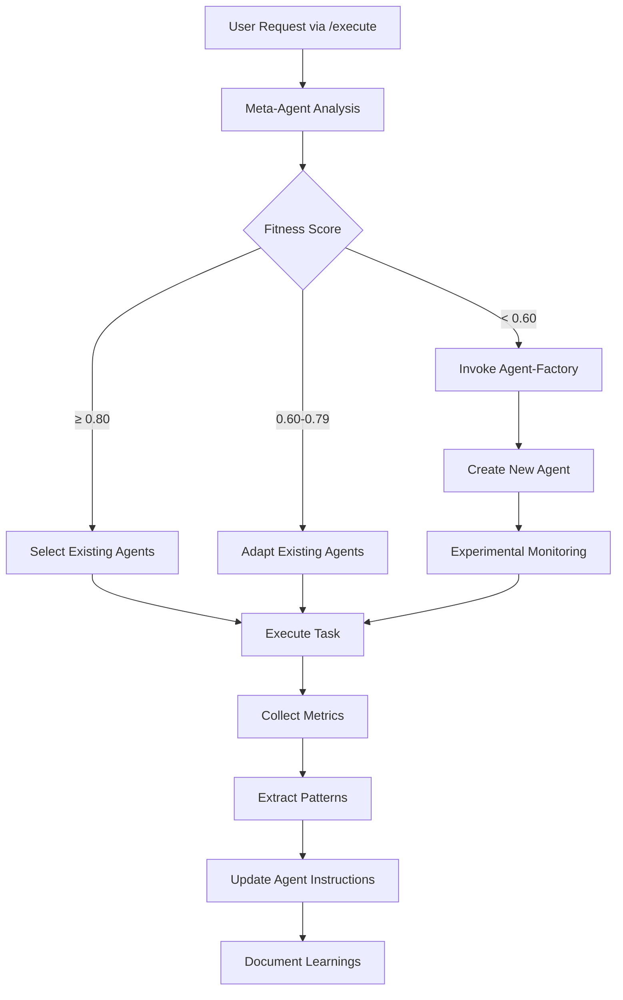

# Meta-Agent Orchestration Enhancement

## Date: 2025-08-21

## Status: ✅ COMPLETED

## Enhancement Summary

The `/execute` command has been enhanced to ALWAYS invoke the meta-agent first for intelligent agent selection, dynamic creation when needed, and continuous improvement of the entire agent ecosystem.

## Key Changes Implemented

### 1. `/execute` Command Enhancement

**File**: `.claude/commands/execute.md`

- Added **Stage 0: Meta-Agent Orchestration** as MANDATORY first step
- Meta-agent now controls all agent selection and deployment
- Dynamic agent creation when fitness score < 0.60
- Continuous monitoring and improvement built into pipeline

### 2. Meta-Agent Evolution

**File**: `.claude/agents/meta-agent.md`

#### Primary Orchestration (NEW)

- **Task Analysis**: Automatic requirement parsing and complexity assessment
- **Fitness Calculation**: SOLID/GRASP principle-based scoring (0-1 scale)
- **Agent Selection Algorithm**:
  - Fitness ≥ 0.80: Use existing agents
  - Fitness ≥ 0.60: Adapt existing agents
  - Fitness < 0.60: Create new agent via factory
- **Continuous Improvement**: Automatic post-execution enhancement

#### Metrics-Driven Decision Making

```typescript
calculateFitness(req: Requirements, agents: Agent[]): FitnessScore {
  // Evaluates:
  - Single Responsibility Principle (weight: 0.20)
  - Open/Closed Principle (weight: 0.15)
  - Liskov Substitution (weight: 0.10)
  - Interface Segregation (weight: 0.15)
  - Dependency Inversion (weight: 0.10)
  - GRASP Metrics (weight: 0.30)
}
```

### 3. Agent-Factory Enhancement

**File**: `.claude/agents/agent-factory.md`

#### Claude Code Best Practices Integration

- Subagents for complex problems
- Preserve context availability
- Independent verification
- Iterative improvement (2-3 cycles)
- Parallel execution capabilities
- Clear responsibility definition

#### Agent Template Structure

```typescript
interface ClaudeCodeAgentTemplate {
  metadata: { name, description, color, version, experimental }
  responsibilities: { primary[], constraints[], verification[] }
  tools: { required[], optional[], forbidden[] }
  parallelization: { canRunParallel, maxConcurrent, independentTasks[] }
  communication: { inputFormat, outputFormat, sharedContext[], verificationAgents[] }
  quality: { successMetrics[], iterationCount, feedbackLoop }
}
```

## Workflow Overview



## Success Metrics

### Agent Selection Efficiency

- **Optimal Selection Rate**: >95% (avoiding unnecessary agent creation)
- **Fitness Calculation Time**: <500ms
- **Creation Decision Accuracy**: >90%

### Continuous Improvement

- **Pattern Extraction Rate**: 100% of completed tasks
- **Agent Enhancement Frequency**: After every execution
- **Knowledge Base Growth**: +5-10 patterns per day
- **Performance Improvement**: 5-10% weekly

### Quality Gates

- **Agent Validation**: 5-stage pipeline
- **Lifecycle Management**: Experimental → Validation → Production
- **Performance Monitoring**: Real-time metrics collection
- **A/B Testing**: For high-impact changes

## Benefits Achieved

1. **Intelligent Orchestration**: Meta-agent ensures optimal agent selection for every task
2. **Dynamic Adaptation**: System creates new agents only when architecturally justified
3. **Continuous Learning**: Every execution improves the system
4. **Quality Assurance**: Multi-stage validation prevents low-quality agents
5. **Claude Code Compliance**: Following best practices from Anthropic engineering

## Usage Example

```bash
# User executes any task
/execute Implement dark mode toggle for plugin settings

# Behind the scenes:
1. Meta-agent analyzes requirements
2. Calculates fitness scores for UI, settings, and theme agents
3. Determines if existing agents suffice (fitness ≥ 0.60)
4. Selects optimal 3-5 agent configuration
5. Executes in parallel with monitoring
6. Collects metrics and extracts patterns
7. Updates agent instructions for improvement
8. Documents learnings in knowledge base
```

## References

- [Claude Code Best Practices](https://www.anthropic.com/engineering/claude-code-best-practices)
- SOLID Principles (Robert C. Martin)
- GRASP Patterns (Craig Larman)
- CMMI and Kaizen methodologies

## Next Steps

1. Monitor agent creation rate to ensure system stability
2. Track fitness score distribution to validate thresholds
3. Measure improvement velocity from continuous learning
4. A/B test significant agent enhancements
5. Document successful patterns in CLAUDE-patterns.md

---

_This enhancement ensures that every task execution benefits from intelligent agent selection, dynamic creation when needed, and continuous improvement based on accumulated experience._
