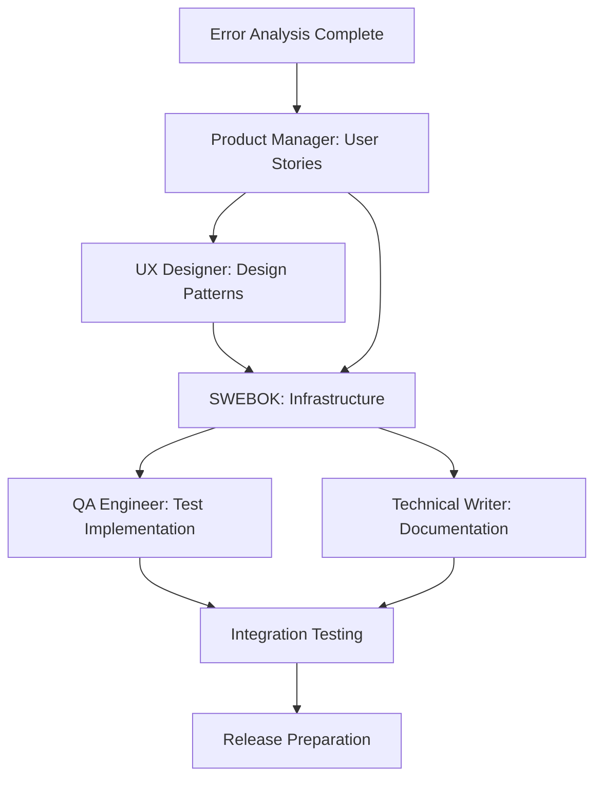

# Better Error Messages Feature - Multi-Agent Implementation Plan

## Executive Summary

**Feature**: Better Error Messages (RICE Score: 15000 - Highest Priority)  
**Target Release**: v2.11.0  
**Implementation Timeline**: 4 weeks  
**Risk Level**: Medium (manageable with proper coordination)

## Current State Analysis

### Critical Issues Identified
1. **SPARQL Processor** (`SPARQLProcessor.ts`): Basic error messages without location information
2. **Security Sanitizer** (`SPARQLSanitizer.ts`): Technical jargon blocking valid queries  
3. **Modal Validation**: No inline feedback for asset creation errors
4. **RDF Processing**: Generic import/export failures without specificity
5. **System Integration**: Poor error communication from background operations

### User Impact Assessment
- **High Impact**: SPARQL syntax errors (primary user interaction)
- **Medium Impact**: Asset creation validation, RDF import/export
- **Low Impact**: System-level errors, cache issues

## Agent Coordination Matrix

| Phase | Week | Primary Agent | Supporting Agents | Deliverable |
|-------|------|---------------|-------------------|-------------|
| **Planning** | 1 | Product Manager | UX Designer | User stories & acceptance criteria |
| **Design** | 1-2 | UX Designer | Product Manager, SWEBOK | UI patterns & component specs |
| **Development** | 2-3 | SWEBOK Engineer | UX Designer, QA | Core infrastructure & SPARQL enhancements |
| **Testing** | 3-4 | QA Engineer | SWEBOK, Product Manager | Test suite & validation |
| **Documentation** | 4 | Technical Writer | All agents | Help docs & error reference |

## Task Dependencies & Critical Path

## Implementation Phases

### Phase 1: Foundation (Week 1)
**Primary**: Product Manager → UX Designer  
**Goal**: Define requirements and design patterns

#### Product Manager Tasks (TASK-2025-009)
- [ ] Create user personas for error scenarios
- [ ] Define 15+ detailed user stories
- [ ] Establish acceptance criteria
- [ ] Priority matrix for error types

#### UX Designer Tasks (TASK-2025-010)
- [ ] Design error message component system
- [ ] Create 5 high-fidelity mockups
- [ ] Establish accessibility standards
- [ ] Define responsive error patterns

**Week 1 Success Criteria**: Approved user stories and design system ready for development

### Phase 2: Core Development (Week 2-3)  
**Primary**: SWEBOK Engineer  
**Goal**: Implement error handling infrastructure

#### SWEBOK Engineer Tasks (TASK-2025-011)
- [ ] Build centralized ErrorHandler service
- [ ] Enhance SPARQL parser with line/column tracking
- [ ] Implement fix suggestion system
- [ ] Create error display components
- [ ] Integration with existing architecture

**Key Technical Deliverables**:
- `ErrorHandlerService` with structured error processing
- Enhanced `SPARQLProcessor` with detailed syntax errors  
- Unified error display components
- Performance-optimized error analysis (<10ms overhead)

### Phase 3: Quality Assurance (Week 3-4)
**Primary**: QA Engineer  
**Goal**: Comprehensive testing and validation

#### QA Engineer Tasks (TASK-2025-012)
- [ ] Design error scenario test suite
- [ ] Implement performance benchmarks
- [ ] Accessibility compliance validation
- [ ] User experience testing protocols

**Testing Coverage**:
- 100% coverage of identified error scenarios
- Performance regression prevention
- Accessibility WCAG 2.1 AA compliance
- User clarity validation

### Phase 4: Documentation & Polish (Week 4)
**Primary**: Technical Writer  
**Supporting**: All agents for review

- [ ] Error message reference documentation
- [ ] User help guides for common errors
- [ ] Developer documentation for error handling patterns
- [ ] Integration with existing plugin documentation

## Risk Assessment & Mitigation

### High Risk Areas

#### 1. Performance Impact
**Risk**: Error analysis slowing down normal operations  
**Mitigation**: 
- Implement performance budgets (<10ms for error analysis)
- Use lazy loading for complex error suggestions
- Cache common error patterns

#### 2. Breaking Changes
**Risk**: New error handling affecting existing functionality  
**Mitigation**:
- Maintain backward compatibility with Result<T> pattern
- Implement feature flags for gradual rollout
- Comprehensive regression testing

#### 3. User Experience Complexity
**Risk**: Too much information overwhelming users  
**Mitigation**:
- Progressive disclosure design (basic → advanced details)
- User-configurable error verbosity levels
- A/B testing for message clarity

### Medium Risk Areas
- Integration complexity with existing DI container
- Accessibility requirements adding development time
- Internationalization preparation requirements

## Success Metrics

### Technical KPIs
- [ ] <10ms error analysis performance
- [ ] 95% test coverage for error handling paths
- [ ] Zero accessibility violations
- [ ] <1% performance regression in normal operations

### User Experience KPIs  
- [ ] 80% reduction in error-related support requests
- [ ] 90% user success rate resolving SPARQL syntax errors
- [ ] 95% error message user satisfaction rating
- [ ] 75% user preference for new vs. old error messages

## Agent Communication Protocol

### Daily Standups (Virtual)
Each agent reports progress and blockers via task status updates

### Weekly Coordination (Asynchronous)
- Monday: Sprint planning and task prioritization
- Wednesday: Progress check and dependency resolution  
- Friday: Week completion review and next week planning

### Critical Escalation Process
1. **Blocker Identification**: Agent updates task status to "blocked"
2. **Orchestrator Review**: Assessment within 2 hours
3. **Resolution Coordination**: Cross-agent collaboration as needed
4. **Timeline Adjustment**: If required, with stakeholder notification

## Resource Requirements

### Development Resources
- No additional external dependencies required
- Leverage existing test infrastructure
- Use current Obsidian Plugin API capabilities

### Documentation Resources
- Help page creation in existing docs structure
- Error reference guide integration
- Code example and pattern documentation

## Quality Gates

### Pre-Development Checklist
- [ ] All user stories have clear acceptance criteria
- [ ] Design patterns approved by UX review
- [ ] Technical approach validated by architecture review

### Pre-Testing Checklist  
- [ ] Core infrastructure implemented and integrated
- [ ] Error scenarios identified and catalogued
- [ ] Performance benchmarks established

### Pre-Release Checklist
- [ ] All error scenarios tested and validated
- [ ] Performance benchmarks met
- [ ] Accessibility compliance verified
- [ ] Documentation complete and reviewed

## Integration Points

### With Current Architecture
- Extends existing `Result<T>` pattern without breaking changes
- Integrates with current DI container structure
- Leverages existing test infrastructure and CI/CD pipeline

### With Future Features
- Error handling system designed for extensibility
- Internationalization preparation for future localization
- API integration readiness for advanced error reporting

## Post-Implementation Plan

### Monitoring & Feedback
- User feedback collection on error message helpfulness
- Performance monitoring for error handling overhead
- Analytics on error resolution success rates

### Iteration Planning
- Quarterly error message quality reviews
- Continuous improvement based on user feedback
- Pattern library updates as new error scenarios emerge

---

## Conclusion

The Better Error Messages feature represents a critical user experience improvement for the Exocortex plugin. Through coordinated multi-agent implementation, we can deliver a comprehensive error handling system that educates users, prevents frustration, and builds confidence in using SPARQL and RDF features.

The implementation plan balances technical robustness with user empathy, ensuring every error becomes an opportunity for learning rather than a source of confusion. Success depends on tight coordination between specialized agents and maintaining focus on user-centered design principles.

**Next Step**: Begin agent task assignments and initiate Phase 1 implementation.