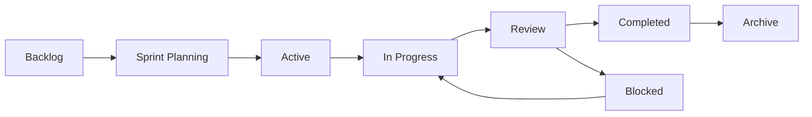

# 📋 Claude Task Tracker System

## Overview
Персистентная система управления задачами для AI-агентов, интегрированная с memory-bank для полной трассируемости.

## Directory Structure

```
.claude/tasks/
├── active/           # Текущие задачи в работе
│   └── YYYY-MM-DD/   # Задачи по дням
├── completed/        # Завершенные задачи с результатами
│   └── YYYY-MM/      # Архив по месяцам
├── backlog/          # Бэклог задач
│   ├── product/      # Продуктовые задачи
│   ├── technical/    # Технический долг
│   └── research/     # Исследования
├── epics/            # Эпики и крупные инициативы
│   └── *.epic.md     # Файлы эпиков
└── sprints/          # Спринты (2-недельные итерации)
    └── sprint-NN/    # Папки спринтов
```

## Task Format

### Task File Structure
```yaml
# TASK-{ID}-{SHORT-NAME}.md

id: TASK-2024-001
title: Implement User Authentication
type: feature|bug|improvement|research
priority: critical|high|normal|low
status: todo|in_progress|review|blocked|done
assignee: {agent-name}
epic: EPIC-001
sprint: sprint-01
created: 2024-01-15T10:00:00Z
updated: 2024-01-15T14:30:00Z
estimated: 4h
actual: null
tags: [auth, security, backend]

## Description
Detailed task description...

## Acceptance Criteria
- [ ] Criterion 1
- [ ] Criterion 2

## Technical Notes
Implementation details...

## Dependencies
- TASK-2024-000: Previous related task

## Results
Output and deliverables...

## Memory Bank References
- CLAUDE-requirements.md#auth-requirements
- CLAUDE-architecture.md#auth-design
```

## Integration with Memory Bank

### Automatic Sync Points
1. **Task Creation** → Updates CLAUDE-roadmap.md
2. **Task Completion** → Updates CLAUDE-features.md
3. **Sprint Planning** → Updates CLAUDE-sprints.md
4. **Epic Progress** → Updates CLAUDE-roadmap.md
5. **Bug Reports** → Updates CLAUDE-errors.md

### Traceability Matrix
```
Task → Requirement → Feature → Test → Release
```

## Task Lifecycle



## Agent Task Protocols

### Creating Tasks
```bash
# Agent creates new task
echo "task content" > .claude/tasks/backlog/{category}/TASK-{ID}.md
```

### Moving to Active
```bash
# During sprint planning
mv .claude/tasks/backlog/{category}/TASK-{ID}.md \
   .claude/tasks/active/$(date +%Y-%m-%d)/
```

### Completing Tasks
```bash
# Mark as done and archive
mv .claude/tasks/active/*/TASK-{ID}.md \
   .claude/tasks/completed/$(date +%Y-%m)/
```

## Metrics Tracking

### Velocity Metrics
- Tasks completed per sprint
- Story points delivered
- Cycle time per task type
- Agent productivity metrics

### Quality Metrics
- Bugs per feature
- Rework percentage
- Test coverage impact
- Documentation completeness

## Daily Standup Format

```markdown
# Daily Standup - {DATE}

## Yesterday
- Completed: [TASK-001, TASK-002]
- Blocked: [TASK-003]

## Today
- In Progress: [TASK-004, TASK-005]
- Planned: [TASK-006]

## Blockers
- TASK-003: Waiting for API access

## Metrics
- Sprint Progress: 45%
- Velocity: On Track
```

## Sprint Planning Template

```markdown
# Sprint {N} Planning

## Sprint Goal
Main objective for this sprint

## Committed Tasks
- TASK-001: 3 points
- TASK-002: 5 points
- TASK-003: 2 points
Total: 10 points

## Stretch Goals
- TASK-004: 3 points

## Risks
- Risk 1: Mitigation plan

## Success Criteria
- All committed tasks completed
- Test coverage maintained
- Documentation updated
```

## Epic Template

```markdown
# EPIC-{ID}: {Epic Title}

## Vision
High-level goal and value proposition

## Success Metrics
- KPI 1: Target value
- KPI 2: Target value

## Milestones
- [ ] Milestone 1: Date
- [ ] Milestone 2: Date

## Tasks
- [ ] TASK-001: Task title
- [ ] TASK-002: Task title

## Dependencies
- External dependencies
- Internal dependencies

## Risks
- Risk assessment and mitigation
```

## Automation Scripts

### Task Status Update
```bash
# Update task status
sed -i 's/status: .*/status: in_progress/' TASK-{ID}.md
```

### Generate Sprint Report
```bash
# Count tasks by status
find .claude/tasks/active -name "*.md" -exec grep "status:" {} \; | sort | uniq -c
```

### Archive Old Tasks
```bash
# Move completed tasks older than 30 days
find .claude/tasks/completed -mtime +30 -type f -exec mv {} .claude/tasks/archive/ \;
```

## Integration Points

### With Agents
- Orchestrator: Creates and assigns tasks
- Scrum Master: Manages sprints
- Product Manager: Maintains backlog
- Meta Agent: Analyzes metrics

### With Memory Bank
- Requirements → Tasks
- Tasks → Features
- Features → Documentation
- Documentation → Knowledge Base

## Best Practices

1. **One Task, One File**: Each task in separate file
2. **Daily Updates**: Status updated daily
3. **Sprint Boundaries**: Tasks within sprint scope
4. **Clear Dependencies**: Explicit task relationships
5. **Result Documentation**: Always document outcomes
6. **Memory Bank Sync**: Keep references current
7. **Metric Collection**: Track all work
8. **Regular Archival**: Monthly archive process