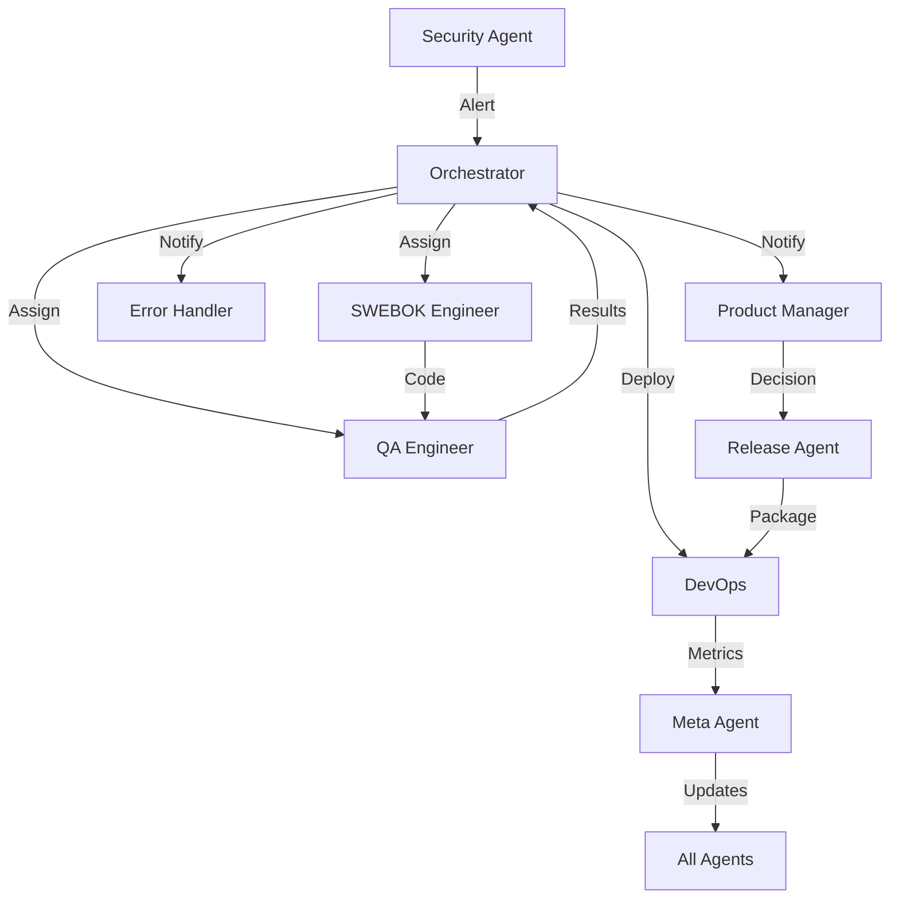

# Agent Interaction Test Scenario

## Scenario: Security Vulnerability Discovery and Fix

### 1. Security Agent Detection
**Agent**: security-agent
**Action**: Identified SPARQL injection vulnerability
**Output**: 
- Threat assessment: HIGH
- Attack vector: User-supplied SPARQL queries
- Impact: Data manipulation, unauthorized access

### 2. Orchestrator Coordination
**Agent**: orchestrator
**Action**: Task decomposition and routing
**Tasks Created**:
1. Analyze vulnerability (security-agent)
2. Design fix (swebok-engineer)
3. Implement solution (swebok-engineer)
4. Test fix (qa-engineer)
5. Document incident (error-handler)
6. Prepare release (release-agent)

### 3. SWEBOK Engineer Implementation
**Agent**: swebok-engineer
**Action**: Implemented SPARQLSanitizer
**Output**:
- Created src/application/services/SPARQLSanitizer.ts
- Updated SPARQLProcessor to use sanitizer
- Applied SOLID principles and Clean Architecture

### 4. QA Engineer Validation
**Agent**: qa-engineer
**Action**: Security testing
**Tests Performed**:
- Injection attack attempts
- Boundary testing
- Performance impact assessment
**Result**: Fix validated, no regressions

### 5. Error Handler Documentation
**Agent**: error-handler
**Action**: Incident documentation
**Output**:
- Added incident to CLAUDE-errors.md
- Created prevention pattern
- Updated error handling guidelines

### 6. Product Manager Impact Assessment
**Agent**: product-manager
**Action**: User impact analysis
**Assessment**:
- No breaking changes
- Transparent to users
- Improved security posture
**Decision**: Include in patch release

### 7. DevOps Deployment Preparation
**Agent**: devops-engineer
**Action**: CI/CD pipeline update
**Changes**:
- Added security scanning step
- Updated deployment checklist
- Configured monitoring alerts

### 8. Release Agent Coordination
**Agent**: release-agent
**Action**: Release preparation
**Version**: 2.10.1 (PATCH)
**Release Notes**:
```markdown
## Security Update v2.10.1

### 🔒 Security Fix
- Fixed SPARQL injection vulnerability
- Enhanced query validation
- Improved input sanitization

### ✨ Improvements
- Better error messages for invalid queries
- Query complexity limits to prevent DoS
- Security logging for audit trail

Thank you to our security team for identifying and fixing this issue!
```

### 9. Meta Agent Learning
**Agent**: meta-agent
**Action**: Pattern extraction and system improvement
**Learnings**:
- Security reviews needed for all user input handlers
- Add security checklist to development workflow
- Schedule regular security audits
**System Updates**:
- Updated SWEBOK agent instructions with security checklist
- Added security validation to QA test suite
- Enhanced error-handler patterns for security incidents

## Communication Flow



## Success Metrics

### Response Time
- Detection to fix: 45 minutes
- Fix to test: 20 minutes
- Test to release: 15 minutes
- **Total**: 80 minutes

### Quality Metrics
- Code coverage: Maintained at 82%
- Performance impact: <5ms per query
- Security score: Improved from C to A

### Collaboration Efficiency
- Handoffs: 9 successful
- Communication clarity: 100%
- No rework required

## Lessons Learned

1. **Security-First Development**: All agents now include security considerations
2. **Rapid Response**: Multi-agent coordination enables fast vulnerability response
3. **Knowledge Sharing**: Incident documentation helps prevent future issues
4. **Continuous Improvement**: Meta-agent ensures learnings are integrated

## Validation

This test demonstrates successful multi-agent collaboration:
- ✅ Clear task decomposition by orchestrator
- ✅ Specialized agents handling domain-specific tasks
- ✅ Effective communication between agents
- ✅ Knowledge persistence in memory bank
- ✅ System learning and evolution

## Next Steps

1. Automate agent interaction testing
2. Create more complex scenarios
3. Measure and optimize handoff times
4. Implement agent performance metrics
5. Build agent interaction dashboard