# Exocortex Architecture

**Version**: 0.0.0-dev
**Last Updated**: 2025-10-26
**Status**: Current State (Before Core Extraction)

---

## 📖 Table of Contents

1. [System Overview](#system-overview)
2. [Technology Stack](#technology-stack)
3. [Architecture Layers](#architecture-layers)
4. [Dependency Injection](#dependency-injection)
5. [Component Responsibilities](#component-responsibilities)
6. [Data Flow](#data-flow)
7. [Property Schema](#property-schema)
8. [Design Patterns](#design-patterns)
9. [Current Limitations](#current-limitations)
10. [Future Architecture](#future-architecture)

---

## 🎯 System Overview

### What is Exocortex?

Exocortex is a **knowledge management technology** that provides:
- **Asset management**: Tasks, projects, areas, concepts, prototypes
- **Status workflows**: Complete lifecycle (Draft → Backlog → Analysis → ToDo → Doing → Done)
- **Hierarchical organization**: Areas, projects, and task relationships
- **Time tracking**: Automatic timestamps for effort lifecycle
- **Priority voting**: Collaborative task prioritization
- **Knowledge graphs**: Visual representation of relationships

### Current Implementation

**Exocortex Obsidian Plugin** is the first adapter for Exocortex technology, providing a rich UI interface through Obsidian. It is **NOT** the core technology itself - just one interface to it.

**Key Insight**: All business logic (frontmatter generation, status transitions, property validation) should be storage-agnostic. The plugin currently mixes business logic with Obsidian-specific UI code, which will be refactored in Issue #122.

---

## 🛠️ Technology Stack

### Core Technologies

```yaml
Language: TypeScript 4.8.4
Runtime: Obsidian Plugin API 1.5.0+
UI Framework: React 19.2.0
Build Tool: ESBuild 0.17.3
Package Manager: npm
```

### Testing Stack

```yaml
Unit Tests: Jest 30.0.5 + ts-jest
UI Tests: jest-environment-obsidian 0.0.1
Component Tests: Playwright CT 1.55.1
E2E Tests: Playwright 1.55.1 (Docker)
Coverage: Jest coverage (current: 44%, target: 95%)
BDD: Gherkin features (current: 80% coverage)
```

### Code Quality

```yaml
Linter: ESLint 9.38.0
  - typescript-eslint 8.46.2
  - eslint-plugin-obsidianmd 0.1.6 (official)
Formatter: Prettier 3.6.2
Pre-commit: Husky 9.1.7
Type Checking: TypeScript (noImplicitAny, strictNullChecks)
```

### Domain Technologies

```yaml
Data Format: YAML frontmatter + Markdown
Identifiers: UUID v4
Timestamps: ISO 8601 local time
References: WikiLinks ([[FileName]])
Graph: D3.js force-directed (force-graph 1.51.0)
```

---

## 📦 Monorepo Organization

Exocortex is organized as a **monorepo** with multiple npm workspaces:

```
/packages
  /core                       - @exocortex/core (storage-agnostic business logic)
  /obsidian-plugin            - @exocortex/obsidian-plugin (Obsidian UI integration)
  /cli                        - @exocortex/cli (command-line automation tool)
```

**Benefits:**
- **Shared Core Logic**: Business logic in `@exocortex/core` is reused by both plugin and CLI
- **Independent Versioning**: Each package has its own version and release cycle
- **Clear Boundaries**: Enforces separation between storage-agnostic logic and UI/CLI adapters
- **Parallel Development**: Teams can work on different packages independently

## 🏗️ Architecture Layers

Exocortex follows **Clean Architecture** principles with clear separation of concerns.

### Layer 1: Domain Layer (in @exocortex/core)

**Purpose**: Core business entities, rules, and logic independent of any framework

**Location**: `packages/core/src/domain/`

**Components**:
- **Constants**: `AssetClass`, `EffortStatus` enums
- **Models**: `GraphNode`, `GraphData`, `AreaNode` interfaces
- **Commands**: Visibility rules (`CommandVisibility.ts`)
- **Settings**: Plugin configuration interfaces

**Dependencies**: ZERO external dependencies (pure TypeScript)

**Characteristics**:
- ✅ Pure functions only
- ✅ No framework imports
- ✅ Highly testable (100% unit testable)
- ✅ Reusable across adapters (CLI, Web, Mobile)

### Layer 2: Application Layer (in @exocortex/core)

**Purpose**: Use cases and business services

**Location**: `packages/core/src/application/services/`

**Components**:
- `CommandManager` - Facade for all 26 commands
- 14 specialized services (TaskCreationService, ProjectCreationService, etc.)

**Dependencies**: Domain layer, IFileSystemAdapter interface

**Characteristics**:
- Orchestrates domain logic
- Uses infrastructure interfaces (not concrete implementations)
- Framework-agnostic business workflows
- ✅ Fully testable without Obsidian

### Layer 3: Infrastructure Layer (split between packages)

**Purpose**: Implementation details and external integrations

**Core Infrastructure** (`packages/core/src/infrastructure/`):
- **IFileSystemAdapter**: Abstract interface for storage operations
- **Utilities**: Pure helpers (DateFormatter, WikiLinkHelpers, FrontmatterService)

**Obsidian Plugin Infrastructure** (`packages/obsidian-plugin/src/infrastructure/`):
- **ObsidianVaultAdapter**: Implements IFileSystemAdapter using Obsidian Vault API
- **Obsidian-specific utilities**: MetadataExtractor, cache management

**CLI Infrastructure** (`packages/cli/src/infrastructure/`):
- **NodeFsAdapter**: Implements IFileSystemAdapter using Node.js fs module
- **File system operations**: Direct file manipulation

**Dependencies**:
- Core: Zero external dependencies
- Plugin: Obsidian API (Vault, MetadataCache, TFile)
- CLI: Node.js fs, path modules

### Layer 4: Presentation Layer (in @exocortex/obsidian-plugin)

**Purpose**: User interface and user interactions

**Location**: `packages/obsidian-plugin/src/presentation/`

**Components**:
- **Components**: React components (13 total)
- **Renderers**: Layout renderers (3 total)
- **Builders**: UI builders (`ButtonGroupsBuilder`)
- **Modals**: Input dialogs (6 total)

**Dependencies**: Obsidian API (App, Modal), React, @exocortex/core

**Characteristics**:
- Obsidian-specific UI
- React state management
- Event handlers and user interactions
- Uses core services through dependency injection

---

## 🧩 Dependency Injection

### Overview

Exocortex uses **TSyringe** (Microsoft's lightweight DI container) for dependency injection across all packages. This enables clean architecture patterns, testability, and cross-platform support.

**Why TSyringe?**
- **Lightweight**: ~2KB bundle size (vs InversifyJS ~50KB)
- **Simple API**: Decorator-based with minimal boilerplate
- **TypeScript-native**: Full type safety with Symbol tokens
- **Cross-platform**: Works in both Obsidian (browser) and Node.js (CLI)

**Architecture Benefits:**
- **Separation of concerns**: Business logic independent of infrastructure
- **Testability**: Easy mocking of dependencies
- **Platform abstraction**: Same service works in Obsidian and CLI
- **Configuration flexibility**: Swap implementations without changing services

### Injectable Interfaces

All cross-cutting concerns are abstracted through interfaces in `@exocortex/core`:

| Interface | Purpose | Obsidian Implementation | CLI Implementation |
|-----------|---------|------------------------|-------------------|
| **ILogger** | Structured logging | `ObsidianLogger` (console) | `NodeLogger` (stdout) |
| **IEventBus** | Pub/sub messaging | `ObsidianEventBus` (in-memory) | `NodeEventBus` (in-memory) |
| **IConfiguration** | Settings management | `ObsidianConfiguration` (plugin data) | `NodeConfiguration` (~/.exocortexrc) |
| **INotificationService** | User notifications | `ObsidianNotificationService` (Notice API) | `NodeNotificationService` (console) |
| **IVaultAdapter** | File operations | `ObsidianVaultAdapter` (Vault API) | `NodeFileSystemAdapter` (fs module) |

**Interface Definitions:**
```typescript
// packages/core/src/interfaces/ILogger.ts
export interface ILogger {
  debug(message: string, context?: Record<string, any>): void;
  info(message: string, context?: Record<string, any>): void;
  warn(message: string, context?: Record<string, any>): void;
  error(message: string, error?: Error, context?: Record<string, any>): void;
}

// packages/core/src/interfaces/IEventBus.ts
export interface IEventBus {
  publish<T = any>(eventName: string, data: T): void;
  subscribe<T = any>(eventName: string, handler: (data: T) => void): () => void;
  unsubscribe(eventName: string, handler: (data: any) => void): void;
}

// packages/core/src/interfaces/IConfiguration.ts
export interface IConfiguration {
  get<T = any>(key: string): T | undefined;
  set<T = any>(key: string, value: T): Promise<void>;
  getAll(): Record<string, any>;
}

// packages/core/src/interfaces/INotificationService.ts
export interface INotificationService {
  info(message: string, duration?: number): void;
  success(message: string, duration?: number): void;
  error(message: string, duration?: number): void;
  warn(message: string, duration?: number): void;
  confirm(title: string, message: string): Promise<boolean>;
}
```

### DI Tokens (Type-Safe Injection)

Tokens are Symbol-based constants defined in `@exocortex/core/interfaces/tokens.ts`:

```typescript
export const DI_TOKENS = {
  IFileSystemAdapter: Symbol.for("IFileSystemAdapter"),
  IVaultAdapter: Symbol.for("IVaultAdapter"),
  ILogger: Symbol.for("ILogger"),
  IEventBus: Symbol.for("IEventBus"),
  IConfiguration: Symbol.for("IConfiguration"),
  INotificationService: Symbol.for("INotificationService"),
} as const;

export type DIToken = typeof DI_TOKENS[keyof typeof DI_TOKENS];
```

**Why Symbols over strings?**
- **Type safety**: TypeScript checks prevent typos
- **No collisions**: Symbol.for() ensures global uniqueness
- **Refactoring-safe**: Rename interface, Symbol stays same
- **IntelliSense**: Autocomplete shows all available tokens

### Container Setup

#### Obsidian Plugin Container

**Location**: `packages/obsidian-plugin/src/infrastructure/di/PluginContainer.ts`

```typescript
import "reflect-metadata";
import { container } from "tsyringe";
import { DI_TOKENS } from "@exocortex/core";
import { ObsidianLogger } from "./ObsidianLogger";
import { ObsidianEventBus } from "./ObsidianEventBus";
import { ObsidianConfiguration } from "./ObsidianConfiguration";
import { ObsidianNotificationService } from "./ObsidianNotificationService";
import { ObsidianVaultAdapter } from "../../adapters/ObsidianVaultAdapter";

export class PluginContainer {
  static setup(app: App, plugin: Plugin): void {
    // Register logger
    container.register(DI_TOKENS.ILogger, {
      useFactory: () => new ObsidianLogger(plugin),
    });

    // Register event bus
    container.register(DI_TOKENS.IEventBus, {
      useValue: new ObsidianEventBus(),
    });

    // Register configuration
    container.register(DI_TOKENS.IConfiguration, {
      useFactory: () => new ObsidianConfiguration(plugin),
    });

    // Register notification service
    container.register(DI_TOKENS.INotificationService, {
      useValue: new ObsidianNotificationService(),
    });

    // Register vault adapter
    container.register(DI_TOKENS.IVaultAdapter, {
      useFactory: () => new ObsidianVaultAdapter(app.vault, app.metadataCache, app),
    });
  }

  static reset(): void {
    container.clearInstances();
  }
}
```

**Usage in Plugin**:
```typescript
// packages/obsidian-plugin/src/ExocortexPlugin.ts
import "reflect-metadata";
import { PluginContainer } from "./infrastructure/di/PluginContainer";

export default class ExocortexPlugin extends Plugin {
  async onload(): Promise<void> {
    // Initialize DI container (Phase 1 infrastructure)
    PluginContainer.setup(this.app, this);

    // ... rest of plugin initialization
  }
}
```

#### CLI Container

**Location**: `packages/cli/src/infrastructure/di/CLIContainer.ts`

```typescript
import "reflect-metadata";
import { container } from "tsyringe";
import { DI_TOKENS } from "@exocortex/core";
import { NodeLogger } from "./NodeLogger";
import { NodeEventBus } from "./NodeEventBus";
import { NodeConfiguration } from "./NodeConfiguration";
import { NodeNotificationService } from "./NodeNotificationService";

export class CLIContainer {
  static setup(): void {
    container.register(DI_TOKENS.ILogger, {
      useFactory: () => new NodeLogger("exocortex-cli"),
    });

    container.register(DI_TOKENS.IEventBus, {
      useValue: new NodeEventBus(),
    });

    container.register(DI_TOKENS.IConfiguration, {
      useValue: new NodeConfiguration(),
    });

    container.register(DI_TOKENS.INotificationService, {
      useValue: new NodeNotificationService(),
    });
  }

  static reset(): void {
    container.clearInstances();
  }
}
```

### Service Migration Pattern

**Migrating existing services to use DI:**

**Before (manual dependency passing):**
```typescript
export class PropertyCleanupService {
  constructor(
    private vault: IVaultAdapter
  ) {}

  async cleanEmptyProperties(file: IFile): Promise<void> {
    const content = await this.vault.read(file);
    // ... implementation
  }
}

// Manual instantiation
const vaultAdapter = new ObsidianVaultAdapter(app.vault, app.metadataCache, app);
const service = new PropertyCleanupService(vaultAdapter);
```

**After (DI with @injectable and @inject):**
```typescript
import { injectable, inject } from "tsyringe";
import { DI_TOKENS, IVaultAdapter, ILogger, IFile } from "@exocortex/core";

@injectable()
export class PropertyCleanupService {
  constructor(
    @inject(DI_TOKENS.IVaultAdapter) private vault: IVaultAdapter,
    @inject(DI_TOKENS.ILogger) private logger: ILogger
  ) {
    this.logger.debug("PropertyCleanupService initialized");
  }

  async cleanEmptyProperties(file: IFile): Promise<void> {
    this.logger.debug("Cleaning empty properties", { path: file.path });
    const content = await this.vault.read(file);
    // ... implementation
    this.logger.info("Empty properties cleaned", { path: file.path });
  }
}

// Automatic resolution via container
const service = container.resolve(PropertyCleanupService);
```

**Migration Steps:**
1. Add `@injectable()` decorator to class
2. Add `@inject(DI_TOKENS.X)` to constructor parameters
3. Import dependencies from `@exocortex/core`
4. Enable TypeScript decorators in `tsconfig.json`:
   ```json
   {
     "compilerOptions": {
       "experimentalDecorators": true,
       "emitDecoratorMetadata": true
     }
   }
   ```
5. Replace manual instantiation with `container.resolve(ServiceClass)`

### Testing with Dependency Injection

**Test Pattern: Mock Dependencies via Container**

```typescript
import "reflect-metadata";
import { container } from "tsyringe";
import { PropertyCleanupService, DI_TOKENS, IVaultAdapter, ILogger, IFile } from "@exocortex/core";

describe("PropertyCleanupService with DI", () => {
  let mockVaultAdapter: jest.Mocked<IVaultAdapter>;
  let mockLogger: jest.Mocked<ILogger>;
  let service: PropertyCleanupService;

  beforeEach(() => {
    // Clear container before each test
    container.clearInstances();

    // Create mocks
    mockVaultAdapter = {
      read: jest.fn(),
      modify: jest.fn(),
      // ... other methods
    } as any;

    mockLogger = {
      debug: jest.fn(),
      info: jest.fn(),
      warn: jest.fn(),
      error: jest.fn(),
    };

    // Register mocks in container
    container.register(DI_TOKENS.IVaultAdapter, { useValue: mockVaultAdapter });
    container.register(DI_TOKENS.ILogger, { useValue: mockLogger });

    // Resolve service (automatically injects mocks)
    service = container.resolve(PropertyCleanupService);
  });

  afterEach(() => {
    container.clearInstances();
  });

  it("should use injected logger when cleaning properties", async () => {
    const mockFile: IFile = { path: "test.md", name: "test.md", basename: "test", extension: "md" };
    mockVaultAdapter.read.mockResolvedValue("---\ntitle: Test\nemptyProp:\n---\nContent");

    await service.cleanEmptyProperties(mockFile);

    expect(mockLogger.debug).toHaveBeenCalledWith("Cleaning empty properties", { path: "test.md" });
    expect(mockLogger.info).toHaveBeenCalledWith("Empty properties cleaned", { path: "test.md" });
  });

  it("should resolve service singleton from container", () => {
    const service1 = container.resolve(PropertyCleanupService);
    const service2 = container.resolve(PropertyCleanupService);

    expect(service1).toBe(service2);  // Same instance
  });
});
```

**Key Testing Patterns:**
- ✅ Always `container.clearInstances()` in beforeEach/afterEach
- ✅ Register mocks before resolving service
- ✅ Verify injected dependencies are called correctly
- ✅ Test singleton behavior when needed
- ✅ Use `jest.Mocked<Interface>` for type-safe mocks

### Phase 1 Implementation Status

**✅ Completed:**
- TSyringe + reflect-metadata installed
- 4 core interfaces defined (ILogger, IEventBus, IConfiguration, INotificationService)
- Symbol-based DI_TOKENS created
- 4 Obsidian adapters implemented
- 4 CLI adapters implemented
- PluginContainer and CLIContainer created
- TypeScript decorator support enabled
- PropertyCleanupService refactored as proof-of-concept
- DI initialization added to ExocortexPlugin.ts
- Unit tests for DI infrastructure (PluginContainer.test.ts)
- Unit tests for POC service (PropertyCleanupService.di.test.ts)

**📋 Future Phases (Not in Scope):**
- Phase 2: Migrate remaining services to DI
- Phase 3: Implement factory pattern for complex objects
- Phase 4: Add lifecycle management (scoped instances)
- Phase 5: Performance optimization (lazy loading)

---

## 🔧 Component Responsibilities

### Services (14 Total)

| Service | Responsibility | LOC | Dependencies | Pure Logic % |
|---------|----------------|-----|--------------|--------------|
| **TaskCreationService** | Create tasks from areas/projects/prototypes | 354 | Vault | 60% |
| **ProjectCreationService** | Create projects from areas/initiatives | 80 | Vault | 60% |
| **ConceptCreationService** | Create narrower concepts | 65 | Vault | 70% |
| **AreaCreationService** | Create child areas | 66 | Vault | 60% |
| **TaskStatusService** | Manage effort status transitions | 372 | Vault | 70% |
| **EffortVotingService** | Increment effort vote counts | 98 | Vault | 80% |
| **PropertyCleanupService** | Remove empty properties from frontmatter | 133 | Vault | 80% |
| **LabelToAliasService** | Copy labels to aliases array | 68 | Vault | 70% |
| **SupervisionCreationService** | Create CBT supervision notes | 71 | Vault | 80% |
| **AreaHierarchyBuilder** | Build area hierarchy trees | 195 | Vault, MetadataCache | 50% |
| **FrontmatterService** | Parse/manipulate YAML frontmatter | 303 | **None** | **100%** ✅ |
| **RenameToUidService** | Rename files to UID format | 49 | App.fileManager | 0% |
| **FolderRepairService** | Move files to expected folders | 114 | Vault, MetadataCache | 10% |

**Total Lines**: ~2,175 (services only)

### Utilities (5 Total)

| Utility | Purpose | LOC | Obsidian Deps | Type |
|---------|---------|-----|---------------|------|
| **FrontmatterService** | YAML parsing/manipulation | 303 | None | Pure ✅ |
| **DateFormatter** | Date formatting (ISO 8601, WikiLinks) | 89 | None | Pure ✅ |
| **WikiLinkHelpers** | Normalize [[WikiLinks]] | 54 | None | Pure ✅ |
| **MetadataHelpers** | Metadata operations | 142 | None | Pure ✅ |
| **EffortSortingHelpers** | Sort efforts by priority | 76 | None | Pure ✅ |
| **MetadataExtractor** | Extract frontmatter from cache | 165 | MetadataCache | Partial |

**Total Lines**: ~829

**Note**: 5 out of 6 utilities are pure functions (100% testable, 100% reusable).

### Renderers (3 Total)

| Renderer | Purpose | LOC | Type |
|----------|---------|-----|------|
| **UniversalLayoutRenderer** | Main layout coordinator | 816 | Complex |
| **DailyTasksRenderer** | Render daily tasks section | 463 | Complex |
| **DailyProjectsRenderer** | Render daily projects section | 227 | Complex |

### Builders (1 Total)

| Builder | Purpose | LOC | Type |
|---------|---------|-----|------|
| **ButtonGroupsBuilder** | Build action button configurations | 533 | Complex |

### Components (13 Total)

React components for UI rendering:
- `DailyTasksTable.tsx`
- `DailyProjectsTable.tsx`
- `AssetPropertiesTable.tsx`
- `AssetRelationsTable.tsx`
- `AreaHierarchyTree.tsx`
- `ActionButtonsGroup.tsx`
- `CreateTaskButton.tsx`
- `CreateInstanceButton.tsx`
- `StartEffortButton.tsx`
- `MarkTaskDoneButton.tsx`
- `PlanOnTodayButton.tsx`
- `VoteOnEffortButton.tsx`
- `ArchiveTaskButton.tsx`
- `ResponsiveLayout.tsx` (layout wrapper)

**All components have Playwright CT tests** ✅

### Modals (6 Total)

- `LabelInputModal.ts` - Task/project label + size input
- `NarrowerConceptModal.ts` - Concept creation form
- `SupervisionInputModal.ts` - CBT supervision form
- `AreaLabelInputModal.ts` - Area label input
- Plus standard Obsidian modals

---

## 🔄 Data Flow

### Asset Creation Flow


**Key Points**:
- Visibility check happens BEFORE modal opens
- Pure functions (`generateTaskFrontmatter`, `buildFileContent`) have zero dependencies
- Vault operation is the only Obsidian-specific step
- MetadataCache updates automatically

### Status Change Flow


**Key Points**:
- Status validation is pure logic (workflow state machine)
- Timestamps added based on target status
- Frontmatter manipulation is pure function
- UI automatically re-renders on file change

### Layout Rendering Flow


**Key Points**:
- Triggered by metadata changes (Obsidian event system)
- Conditional section rendering based on asset class
- Button visibility determined by CommandVisibility pure functions
- React components handle actual DOM rendering

---

## 📋 Property Schema

### Naming Convention

**Format**: `[prefix]__[EntityType]_[propertyName]`

**Prefixes**:
- `exo__` - Universal Exocortex properties (all assets)
- `ems__` - Effort Management System (tasks, projects, meetings)
- `ims__` - Information Management System (concepts, knowledge)
- `pn__` - Personal Notes (daily notes, journals)
- `ztlk__` - Zettelkasten (note-taking system)

### Core Properties (All Assets)

| Property | Type | Required | Format | Purpose |
|----------|------|----------|--------|---------|
| `exo__Asset_uid` | String | ✅ Yes | UUID v4 | Unique identifier |
| `exo__Asset_label` | String | ✅ Yes | Free text | Human-readable name |
| `exo__Asset_createdAt` | String | ✅ Yes | ISO 8601 | Creation timestamp |
| `exo__Asset_isDefinedBy` | String | ✅ Yes | WikiLink | Ontology reference |
| `exo__Instance_class` | Array | ✅ Yes | WikiLink[] | Asset type(s) |
| `exo__Asset_isArchived` | Boolean/String | No | `true`, `"true"` | Archive status |

### Effort Management Properties

| Property | Type | Assets | Purpose |
|----------|------|--------|---------|
| `ems__Effort_status` | String | Task, Project, Meeting | Current status |
| `ems__Effort_area` | String | Task | Parent area reference |
| `ems__Effort_parent` | String | Task | Parent project reference |
| `exo__Asset_prototype` | String | Task, Meeting | Prototype template |
| `ems__Effort_votes` | Number | Task, Project | Priority vote count |
| `ems__Effort_day` | String | Task, Project | Planned day (WikiLink) |
| `ems__Effort_startTimestamp` | String | Task, Project | When started (→ Doing) |
| `ems__Effort_endTimestamp` | String | Task, Project | When ended (← Doing) |
| `ems__Effort_resolutionTimestamp` | String | Task, Project | When completed (→ Done) |
| `ems__Effort_plannedStartTimestamp` | String | Task, Project | Planned start (evening) |
| `ems__Task_size` | String | Task | Size estimate (S/M/L/XL) |
| `ems__Area_parent` | String | Area | Parent area reference |

### Information Management Properties

| Property | Type | Assets | Purpose |
|----------|------|--------|---------|
| `ims__Concept_broader` | String | Concept | Parent concept |
| `ims__Concept_definition` | String | Concept | Concept definition |

**See [PROPERTY_SCHEMA.md](docs/PROPERTY_SCHEMA.md) for complete reference.**

---

## 🎨 Design Patterns

### 1. Repository Pattern

**Services act as repositories** for asset operations:

```typescript
// TaskCreationService acts as TaskRepository
interface ITaskRepository {
  create(source, metadata, label): Promise<TFile>;
  findByUid(uid): Promise<TFile | null>;
  update(file, changes): Promise<void>;
}
```

**Benefits**:
- Abstraction over storage (Vault)
- Testable with mocks
- Can swap implementations (File system, Cloud, Database)

### 2. Strategy Pattern

**CommandVisibility implements visibility strategies**:

```typescript
// Each visibility function is a strategy
export function canCreateTask(context: CommandVisibilityContext): boolean {
  return isAreaOrProject(context.instanceClass);
}

export function canVoteOnEffort(context: CommandVisibilityContext): boolean {
  return isEffort(context.instanceClass) && !context.isArchived;
}

// Used by CommandManager
if (canCreateTask(context)) {
  // Show command
}
```

**Benefits**:
- Easy to add new visibility rules
- Testable in isolation
- Reusable across UI and CLI

### 3. Facade Pattern

**CommandManager is a facade** for all commands:

```typescript
export class CommandManager {
  registerAllCommands(plugin, reloadCallback) {
    this.registerCreateTaskCommand(plugin);
    this.registerVoteOnEffortCommand(plugin);
    // ... 24 more commands
  }
}
```

**Benefits**:
- Single entry point for command registration
- Hides complexity from ExocortexPlugin
- Easy to mock for testing

### 4. Builder Pattern

**ButtonGroupsBuilder constructs UI configurations**:

```typescript
export class ButtonGroupsBuilder {
  buildButtonGroups(
    file: TFile,
    context: CommandVisibilityContext,
    callbacks: ButtonCallbacks
  ): ButtonGroup[] {
    const groups: ButtonGroup[] = [];

    if (canCreateTask(context)) {
      groups.push({
        id: 'create-task',
        label: 'Create Task',
        onClick: callbacks.onCreateTask,
      });
    }

    // ... build all buttons based on context

    return groups;
  }
}
```

**Benefits**:
- Separates button logic from rendering
- Testable without DOM
- Reusable button configurations

### 5. Observer Pattern

**Obsidian event system**:

```typescript
// In ExocortexPlugin
this.registerEvent(
  this.app.metadataCache.on('changed', (file) => {
    this.handleMetadataChange(file);
  })
);
```

**Benefits**:
- Automatic UI updates on file changes
- Decoupled components
- Standard Obsidian pattern

### 6. Dependency Injection (Partial)

**Services receive Vault in constructor**:

```typescript
export class TaskCreationService {
  constructor(private vault: Vault) {}
}

// In plugin
const service = new TaskCreationService(this.app.vault);
```

**Current State**: Partial DI (only Vault)

**Target State** (Issue #122): Full DI with `IFileSystemAdapter`

---

## 📊 Data Flow Examples

### Example 1: Creating Task from Area

**Step-by-Step**:

1. **User Action**: Opens Area note, clicks "Create Task" button
2. **Visibility Check**: `canCreateTask(context)` returns `true`
3. **Modal Opens**: `LabelInputModal` asks for label + size
4. **User Input**: Enters "Review PR #123", size "M"
5. **Service Call**: `TaskCreationService.createTask()`
6. **Frontmatter Generation** (PURE):
   ```typescript
   {
     exo__Asset_uid: "uuid-v4",
     exo__Asset_label: "Review PR #123",
     exo__Asset_createdAt: "2025-10-26T14:30:00",
     exo__Asset_isDefinedBy: '"[[Ontology/EMS]]"',  // Inherited
     exo__Instance_class: ['"[[ems__Task]]"'],
     ems__Effort_status: '"[[ems__EffortStatusDraft]]"',
     ems__Effort_area: '"[[Work]]"',  // From source Area
     ems__Task_size: "M",
     aliases: ["Review PR #123"]
   }
   ```
7. **File Creation**: `Vault.create("path/uuid.md", content)`
8. **Result**: New file opened in tab, notice shown

### Example 2: Voting on Effort

**Step-by-Step**:

1. **User Action**: Opens Task note, clicks "Vote" button
2. **Visibility Check**: `canVoteOnEffort(context)` returns `true`
3. **Service Call**: `EffortVotingService.incrementEffortVotes(file)`
4. **Read Current Votes**:
   ```typescript
   extractVoteCount(content) // PURE function
   // Returns: 3 (current votes)
   ```
5. **Update Frontmatter** (PURE):
   ```typescript
   updateFrontmatterWithVotes(content, 4)
   // Returns: Updated content with ems__Effort_votes: 4
   ```
6. **Save**: `Vault.modify(file, updatedContent)`
7. **Result**: Vote count incremented, UI refreshes

### Example 3: Status Transition

**Step-by-Step**:

1. **User Action**: Opens Task (status: Backlog), clicks "Move to ToDo"
2. **Visibility Check**: `canMoveToTodo(context)` returns `true`
3. **Service Call**: `TaskStatusService.moveToTodo(file)`
4. **Workflow Validation** (PURE):
   ```typescript
   getPreviousStatusFromWorkflow("ToDo", "ems__Task")
   // Returns: "Analysis" (expected previous status)
   ```
5. **Update Status**:
   ```typescript
   ems__Effort_status: "[[ems__EffortStatusToDo]]"
   ```
6. **No Timestamp**: ToDo doesn't trigger timestamps
7. **Save**: `Vault.modify(file, updatedContent)`
8. **Result**: Status updated, layout re-renders

---

## 🔍 Current State (After Monorepo Migration)

### 1. ✅ RESOLVED: Storage Abstraction

**Previous Problem**: Services directly used Obsidian `Vault`, `MetadataCache`, `TFile`

**Solution Implemented**:
- ✅ Extracted `@exocortex/core` package with `IFileSystemAdapter` interface
- ✅ Created `ObsidianVaultAdapter` in plugin package
- ✅ Created `NodeFsAdapter` in CLI package
- ✅ Services now storage-agnostic

**Result**: Can run business logic without Obsidian, full testability

### 2. ✅ RESOLVED: Core Package Extraction

**Previous Problem**: Business logic mixed with UI code

**Solution Implemented**:
- ✅ Created `@exocortex/core` package with pure business logic
- ✅ Zero external dependencies in core
- ✅ Shared by both plugin and CLI

**Result**: Single source of truth for business rules, no code duplication

### 3. ✅ RESOLVED: Command-Line Interface

**Previous Problem**: No automation without Obsidian running

**Solution Implemented**:
- ✅ Created `@exocortex/cli` package
- ✅ Supports batch operations and automation
- ✅ Works with Claude Code and CI/CD

**Result**: Full automation capabilities for development workflows

### 4. Manual Property Management

**Problem**: Users must manually edit frontmatter for complex operations

**Impact**:
- Error-prone
- Steep learning curve
- Inconsistent formatting

**Solution**: More automated commands (ongoing)

### 5. No Multi-Vault Support

**Problem**: Plugin works with single Obsidian vault only

**Impact**:
- Cannot manage multiple knowledge bases
- No cross-vault operations

**Solution**: Future enhancement (post-#122)

---

## 🚀 Current Architecture (Monorepo Implementation)

### Three-Tier Architecture (IMPLEMENTED)

```mermaid
graph TB
    subgraph Core["@exocortex/core (Pure Business Logic)"]
        Domain[Domain Layer<br/>Constants, Models, Rules]
        Services[Application Services<br/>Task, Project, Status, etc.]
        Utils[Utilities<br/>Frontmatter, Date, WikiLink]
        IFS[IFileSystemAdapter Interface]
    end

    subgraph Adapters["Storage Adapters"]
        ObsidianAdapter[ObsidianVaultAdapter<br/>✅ IMPLEMENTED<br/>Uses Obsidian Vault API]
        NodeFsAdapter[NodeFsAdapter<br/>✅ IMPLEMENTED<br/>Uses Node.js fs]
        CloudAdapter[CloudFsAdapter<br/>🔮 FUTURE: S3, GCS, etc.]
    end

    subgraph Interfaces["User Interfaces"]
        Plugin[Obsidian Plugin<br/>✅ IMPLEMENTED<br/>Visual UI, Modals, Graph]
        CLI[CLI Tool<br/>✅ IMPLEMENTED<br/>Automation, Batch Ops]
        Web[Web Interface<br/>🔮 FUTURE: Browser-based]
    end

    Core --> IFS
    IFS -.implements.-> ObsidianAdapter
    IFS -.implements.-> NodeFsAdapter
    IFS -.implements.-> CloudAdapter
    ObsidianAdapter --> Plugin
    NodeFsAdapter --> CLI
    CloudAdapter -.future.-> Web
```



### Achieved Benefits

**For Users**:
- ✅ CLI for automation (Claude Code integration)
- ✅ Faster development (parallel Core/Plugin work)
- ✅ More reliable (Core has 80% test coverage, 803 unit tests)
- ✅ Batch operations without Obsidian running

**For Developers**:
- ✅ Testable core logic (no Obsidian mocks needed)
- ✅ Multiple UIs (Plugin, CLI, future Web)
- ✅ Clear dependency boundaries via npm workspaces
- ✅ Easier maintenance (one Core, multiple adapters)
- ✅ Independent package versioning

---

## 📚 Additional Resources

- [PROPERTY_SCHEMA.md](docs/PROPERTY_SCHEMA.md) - Complete property reference
- [API_CONTRACTS.md](docs/API_CONTRACTS.md) - Service interfaces and contracts
- [Diagrams](docs/diagrams/) - Architecture and flow diagrams
- [ADRs](docs/adr/) - Architecture decision records
- [CLAUDE.md](CLAUDE.md) - Development guidelines
- [README.md](README.md) - User documentation

---

## 🔄 Revision History

| Version | Date | Changes |
|---------|------|---------|
| 1.0 | 2025-10-26 | Initial architecture documentation (pre-#122) |

---

**Maintainer**: @kitelev
**Related Issues**: #122 (Core Extraction), #123 (Test Coverage), #125 (Type Safety)