# Phase 2: Agent Coordination Matrix & Execution Roadmap
## Multi-Agent Orchestration for Test Coverage Enhancement

### Executive Summary
Phase 2 leverages a coordinated multi-agent approach to achieve 70% overall coverage and 60% branch coverage through parallel execution and specialized expertise. This document provides the operational framework for agent coordination and task execution.

---

## 1. AGENT ROSTER & SPECIALIZATIONS

### Core Agent Team (5 Specialized Agents)

#### 1. Test Infrastructure Agent
```yaml
Agent_Profile:
  Name: "TestInfrastructureAgent"
  Specialization: "CI/CD, Jest Configuration, Coverage Reporting"
  Primary_Skills: ["Jest", "Coverage Analysis", "CI/CD", "Automation"]
  Experience_Level: "Expert"
  
Responsibilities:
  - Fix failing test infrastructure (316 failing tests → <50)
  - Setup enhanced coverage reporting with trend analysis
  - Performance test framework configuration
  - CI/CD pipeline optimization
  
Success_Metrics:
  - Test success rate: 80.4% → 95%
  - CI execution time: <60 seconds
  - Coverage reporting accuracy: 100%
  - Zero infrastructure-related blockers
```

#### 2. Domain Testing Agent
```yaml
Agent_Profile:
  Name: "DomainTestingAgent"
  Specialization: "Business Logic, Entity Testing, Domain Models"
  Primary_Skills: ["Domain-Driven Design", "Entity Testing", "Validation Logic"]
  Experience_Level: "Expert"
  
Responsibilities:
  - Core domain entity branch coverage (Asset, ButtonCommand, Ontology)
  - Business rule validation testing
  - Value object and aggregate testing
  - Domain service coverage improvement
  
Success_Metrics:
  - Domain layer coverage: Current → 80%+
  - Critical business logic: 100% covered
  - Entity validation branches: 90% covered
  - Domain complexity branches addressed
```

#### 3. Integration Testing Agent
```yaml
Agent_Profile:
  Name: "IntegrationTestingAgent"
  Specialization: "End-to-End Workflows, System Integration"
  Primary_Skills: ["Integration Testing", "Workflow Testing", "System Architecture"]
  Experience_Level: "Advanced"
  
Responsibilities:
  - Critical user workflow testing (Asset creation, Property editing, Query execution)
  - Cross-layer integration scenarios
  - Error handling integration paths
  - Repository-Service integration testing
  
Success_Metrics:
  - Critical workflows: 100% tested
  - Integration coverage: 70%+
  - End-to-end scenario success: 95%+
  - Cross-boundary error handling verified
```

#### 4. Performance Testing Agent
```yaml
Agent_Profile:
  Name: "PerformanceTestingAgent"
  Specialization: "Benchmarking, Performance Validation, Optimization"
  Primary_Skills: ["Performance Testing", "Benchmarking", "Profiling"]
  Experience_Level: "Intermediate-Advanced"
  
Responsibilities:
  - Query performance benchmarking (<100ms target)
  - Memory usage validation tests
  - Large dataset handling verification
  - Performance regression prevention
  
Success_Metrics:
  - Query response time: <100ms (95th percentile)
  - Memory usage: <50MB for 1000 assets
  - Performance test coverage: 60%+
  - Benchmark stability: ±5% variance
```

#### 5. Quality Assurance Agent
```yaml
Agent_Profile:
  Name: "QualityAssuranceAgent"
  Specialization: "Quality Gates, Validation, Documentation"
  Primary_Skills: ["Quality Assurance", "Test Strategy", "Documentation"]
  Experience_Level: "Expert"
  
Responsibilities:
  - Daily quality gate validation
  - Coverage trend analysis and reporting
  - Test quality assessment
  - Documentation and knowledge transfer
  
Success_Metrics:
  - Quality gates: 100% compliance
  - Coverage accuracy: Validated daily
  - Documentation completeness: 95%+
  - Knowledge transfer effectiveness: Measured post-phase
```

---

## 2. PARALLEL EXECUTION STRATEGY

### 2.1 Execution Waves

#### Wave 1: Foundation (Days 8-9)

```mermaid
gantt
    title Wave 1 - Foundation Setup
    dateFormat  X
    axisFormat Day %d

    section Infrastructure
    Fix failing tests     :active, infra1, 0, 2
    Coverage reporting    :infra2, 1, 1
    
    section Planning
    Domain analysis      :domain1, 0, 1
    Integration planning :int1, 0, 1
    Performance setup    :perf1, 1, 1
```


**Primary Agent**: Test Infrastructure Agent (100% capacity)
**Supporting Agents**: 
- Domain Testing Agent (25% - analysis)
- Integration Testing Agent (25% - planning)

#### Wave 2: Development Peak (Days 10-11)

```mermaid
gantt
    title Wave 2 - Parallel Development
    dateFormat  X
    axisFormat Day %d

    section Domain Testing
    Core entities        :active, domain1, 0, 2
    Business logic       :domain2, 1, 1
    
    section Integration
    Workflow tests       :active, int1, 0, 2
    Cross-layer tests    :int2, 1, 1
    
    section Performance
    Framework setup      :active, perf1, 0, 1
    Benchmark impl       :perf2, 1, 1
```


**Parallel Execution** (100% capacity each):
- Domain Testing Agent: Core business logic
- Integration Testing Agent: Critical workflows
- Performance Testing Agent: Framework + benchmarks

#### Wave 3: Integration & Validation (Days 12-13)

```mermaid
gantt
    title Wave 3 - Integration Focus
    dateFormat  X
    axisFormat Day %d

    section Integration
    E2E scenarios        :active, int1, 0, 2
    Error handling       :int2, 1, 1
    
    section Performance
    Benchmarks          :active, perf1, 0, 2
    Validation          :perf2, 1, 1
    
    section QA
    Quality gates       :active, qa1, 0, 2
    Validation          :qa2, 1, 1
```


**Primary Agents**:
- Integration Testing Agent (100%)
- Performance Testing Agent (100%)
- Quality Assurance Agent (75%)

### 2.2 Coordination Mechanisms

#### Daily Coordination Meetings (15 minutes)
```yaml
Daily_Standup_Agenda:
  Time: "09:00 AM"
  Duration: "15 minutes"
  
  Round_Robin_Updates:
    - Agent_Name: "[Status update]"
    - Completed_Yesterday: "[Achievements]"
    - Planned_Today: "[Priorities]"
    - Blockers: "[Issues requiring support]"
    - Dependencies: "[Waiting for other agents]"
  
  Coordination_Topics:
    - Cross-agent dependencies
    - Resource conflicts
    - Quality gate status
    - Risk escalations
```

#### Real-Time Communication Channels
- **Slack/Discord**: Immediate coordination
- **GitHub Issues**: Technical blocking issues
- **Shared Coverage Dashboard**: Real-time metrics
- **CI/CD Notifications**: Build status alerts

---

## 3. TASK DEPENDENCY MATRIX

### 3.1 Critical Path Dependencies

| Predecessor Task | Successor Task | Agent | Dependency Type | Buffer Time |
|-----------------|----------------|-------|-----------------|-------------|
| Fix failing tests | Domain coverage | Test Infra → Domain | Finish-to-Start | 0.5 days |
| Coverage reporting | Quality gates | Test Infra → QA | Finish-to-Start | 0 days |
| Domain analysis | Integration tests | Domain → Integration | Start-to-Start | 1 day |
| Framework setup | Benchmarks | Performance → Performance | Finish-to-Start | 0 days |
| Workflow tests | E2E scenarios | Integration → Integration | Finish-to-Start | 0.5 days |

### 3.2 Resource Conflict Resolution

#### Potential Conflicts
1. **CI/CD Pipeline Congestion** (Days 10-11)
   - **Risk**: Multiple agents pushing tests simultaneously
   - **Mitigation**: Staggered commit windows (2-hour slots per agent)
   - **Fallback**: Priority-based queue (Infrastructure > Domain > Integration > Performance)

2. **Test Infrastructure Access** (Days 8-9)
   - **Risk**: Multiple agents modifying test config
   - **Mitigation**: Test Infrastructure Agent owns all config changes
   - **Coordination**: Other agents submit config requests via tickets

3. **Coverage Analysis Conflicts** (Throughout)
   - **Risk**: Inconsistent coverage measurements
   - **Mitigation**: Centralized coverage reporting by QA Agent
   - **Process**: Daily coverage snapshots at 5 PM

---

## 4. EXECUTION PROTOCOLS

### 4.1 Agent Handoff Procedures

#### Work Package Handoff
```yaml
Handoff_Protocol:
  Trigger: "Task completion or blocker encountered"
  
  Handoff_Package:
    - Completed_Work: "[Detailed description]"
    - Quality_Status: "[Pass/Fail with details]"
    - Dependencies_Met: "[List of prerequisites satisfied]"
    - Outstanding_Issues: "[Known problems or risks]"
    - Next_Steps: "[Recommended actions]"
    - Context_Documentation: "[Links to relevant docs/code]"
  
  Acceptance_Criteria:
    - Receiving agent acknowledges understanding
    - Quality gates verified
    - Dependencies confirmed
    - Timeline impact assessed
```

#### Emergency Escalation
```yaml
Escalation_Matrix:
  Level_1_Issues: # Agent-to-Agent Resolution
    Response_Time: "30 minutes"
    Examples: ["Minor blocking dependency", "Clarification needed"]
    
  Level_2_Issues: # PMBOK Agent Intervention
    Response_Time: "2 hours"  
    Examples: ["Schedule impact >4 hours", "Quality gate failure"]
    
  Level_3_Issues: # Stakeholder Involvement
    Response_Time: "Same day"
    Examples: ["Phase target at risk", "Resource unavailable"]
```

### 4.2 Quality Validation Checkpoints

#### Continuous Validation (Automated)
- **Every Commit**: Coverage impact assessment
- **Every Hour**: Test success rate monitoring
- **Every 4 Hours**: Performance benchmark validation

#### Scheduled Validation (Manual)
```yaml
Daily_Quality_Review:
  Time: "5:00 PM"
  Duration: "30 minutes"
  Participants: ["QA Agent", "PMBOK Agent"]
  
  Validation_Checklist:
    - Coverage_Progress: "[Daily target met Y/N]"
    - Test_Stability: "[Success rate >95% Y/N]"
    - Performance_Impact: "[CI time <60s Y/N]"
    - Quality_Gates: "[All gates passing Y/N]"
    - Risk_Status: "[New risks identified Y/N]"
  
  Actions:
    - Update project dashboard
    - Escalate risks if needed
    - Adjust next day priorities
    - Document lessons learned
```

---

## 5. PERFORMANCE MONITORING

### 5.1 Agent Performance Metrics

#### Individual Agent KPIs
```yaml
Agent_Performance_Dashboard:
  Test_Infrastructure_Agent:
    Primary_KPI: "Test success rate improvement"
    Target: "80.4% → 95%"
    Current: "[Real-time tracking]"
    Trend: "[Improving/Stable/Declining]"
    
  Domain_Testing_Agent:
    Primary_KPI: "Domain layer coverage increase"
    Target: "+15% coverage points"
    Current: "[Real-time tracking]"
    Trend: "[Improving/Stable/Declining]"
    
  Integration_Testing_Agent:
    Primary_KPI: "Critical workflow coverage"
    Target: "100% of identified workflows"
    Current: "[Real-time tracking]"
    Trend: "[Improving/Stable/Declining]"
    
  Performance_Testing_Agent:
    Primary_KPI: "Performance benchmarks implemented"
    Target: "5 critical benchmarks"
    Current: "[Real-time tracking]"
    Trend: "[Improving/Stable/Declining]"
    
  Quality_Assurance_Agent:
    Primary_KPI: "Quality gate compliance"
    Target: "100% daily compliance"
    Current: "[Real-time tracking]"
    Trend: "[Improving/Stable/Declining]"
```

#### Team Performance Metrics
```yaml
Team_Performance_KPIs:
  Overall_Efficiency:
    Metric: "Coverage points per agent-day"
    Target: "3.5 points per agent-day"
    Current: "[Calculated daily]"
    
  Collaboration_Effectiveness:
    Metric: "Cross-agent handoff success rate"
    Target: "95% smooth handoffs"
    Current: "[Tracked per handoff]"
    
  Risk_Management:
    Metric: "Risk mitigation response time"
    Target: "<2 hours for Level 2 issues"
    Current: "[Tracked per incident]"
```

---

## 6. SUCCESS CRITERIA & EXIT CONDITIONS

### 6.1 Phase 2 Success Criteria

#### Mandatory Success Criteria (Must Pass All)
```yaml
Mandatory_Criteria:
  Coverage_Targets:
    Overall_Coverage: "≥70% (Current: 55.56%)"
    Branch_Coverage: "≥60% (Current: 44.74%)"
    Function_Coverage: "≥65% (Current: 56.29%)"
    
  Quality_Targets:
    Test_Success_Rate: "≥95% (Current: 80.4%)"
    Flaky_Test_Introduction: "0 new flaky tests"
    CI_Performance: "≤60 seconds execution"
    
  Integration_Targets:
    Critical_Workflows: "100% tested"
    Performance_Benchmarks: "5 benchmarks implemented"
    Documentation_Complete: "≥95% completeness"
```

#### Optional Success Criteria (Stretch Goals)
```yaml
Optional_Criteria:
  Excellence_Targets:
    Overall_Coverage: "≥75%"
    Branch_Coverage: "≥65%"
    Integration_Coverage: "≥80%"
    
  Process_Excellence:
    Agent_Utilization: "≥90%"
    Schedule_Performance: "±5% of plan"
    Zero_Critical_Risks: "No unmitigated high risks"
```

### 6.2 Exit Conditions

#### Successful Completion Conditions
- All mandatory success criteria achieved
- Quality gates passing for 48 consecutive hours
- Stakeholder acceptance obtained
- Knowledge transfer completed
- Phase 3 handoff package prepared

#### Early Termination Conditions
- Critical infrastructure failure (>2 days to resolve)
- Coverage improvement rate <1% per day for 3 consecutive days
- >50% of agent capacity unavailable
- Stakeholder directive to halt

---

## 7. LESSONS LEARNED INTEGRATION

### 7.1 Phase 1 Lessons Applied

#### Process Improvements
- **Parallel Execution**: 40% faster completion through coordinated agents
- **Infrastructure First**: Stable foundation before coverage development
- **Continuous Monitoring**: Real-time dashboard prevents late-stage surprises

#### Technical Improvements
- **Batched Testing**: Optimized CI pipeline for faster feedback
- **Systematic Coverage**: Structured approach to branch coverage
- **Performance Integration**: Early performance testing prevents bottlenecks

### 7.2 Phase 2 Innovation Areas

#### New Approaches in Phase 2
- **Agent Specialization**: Domain-specific expertise allocation
- **Resource Conflict Resolution**: Proactive conflict management
- **Automated Quality Gates**: Continuous validation without manual overhead

---

## 8. CONTINGENCY PLANNING

### 8.1 Scenario-Based Contingencies

#### Scenario 1: Test Infrastructure Crisis
```yaml
Trigger: "Test success rate <80% for >24 hours"
Contingency_Plan:
  Immediate_Actions:
    - Halt all new test development
    - Activate Test Infrastructure Agent at 100% capacity
    - Rollback to last stable test configuration
  
  Recovery_Timeline: "48 hours maximum"
  Success_Criteria: "Test success rate >90%"
  Resource_Reallocation: "All agents support infrastructure fix"
```

#### Scenario 2: Coverage Improvement Stagnation
```yaml
Trigger: "Coverage improvement <1% per day for 3 days"
Contingency_Plan:
  Immediate_Actions:
    - Reduce scope to highest-impact areas
    - Reallocate agents to domain coverage
    - Adjust targets: 65% overall, 55% branch
  
  Recovery_Timeline: "2 days to show improvement"
  Success_Criteria: "Coverage improvement >2% per day"
  Resource_Reallocation: "Focus all agents on core modules"
```

#### Scenario 3: Agent Unavailability
```yaml
Trigger: "Any agent >50% unavailable for >24 hours"
Contingency_Plan:
  Immediate_Actions:
    - Cross-train backup agent in 4 hours
    - Redistribute critical tasks
    - Extend timeline by agent downtime
  
  Recovery_Timeline: "Same day recovery"
  Success_Criteria: "All critical tasks reassigned"
  Resource_Reallocation: "Dynamic rebalancing based on availability"
```

---

## APPENDICES

### Appendix A: Agent Communication Protocols
[Detailed communication templates, escalation procedures, and coordination mechanisms]

### Appendix B: Technical Integration Specifications  
[API specifications, integration test scenarios, and performance benchmarks]

### Appendix C: Quality Gate Detailed Specifications
[Specific acceptance criteria, measurement procedures, and validation scripts]

### Appendix D: Risk Response Playbooks
[Detailed response procedures for each identified risk scenario]

---

**Document Control**:
- Version: 1.0
- Created: Day 8, Phase 2 Initiation  
- Dependencies: PHASE2-PROJECT-PLAN.md
- Next Review: Daily during execution
- Approval: PMBOK Agent, Agent Team Leads