# Phase 2: Test Coverage Improvement Project Plan
## PMBOK-Based Project Management Documentation

### Project Information
- **Project Name**: Exocortex Test Coverage Enhancement - Phase 2
- **Project Manager**: PMBOK Agent
- **Start Date**: Day 8 (Week 2)
- **Target End Date**: Day 14 (Week 2)
- **Project Duration**: 7 days
- **Budget**: 3-4 developer days

---

## 1. PROJECT CHARTER

### 1.1 Project Justification
**Business Case**: The current test coverage of 55.56% overall and 44.74% branch coverage falls short of the enterprise-grade quality standards required for the Exocortex plugin. Phase 2 focuses on achieving sustainable coverage targets while maintaining development velocity.

### 1.2 Project Objectives

#### Primary Objectives
1. **Coverage Targets**:
   - Overall Coverage: 55.56% → 70% (+14.44%)
   - Branch Coverage: 44.74% → 60% (+15.26%)
   - Function Coverage: 56.29% → 65% (+8.71%)
   - Line Coverage: 55.56% → 70% (+14.44%)

2. **Quality Objectives**:
   - Reduce failing tests from 316 to < 50
   - Achieve 95% test suite stability
   - Implement performance benchmarking
   - Establish continuous coverage monitoring

### 1.3 Success Criteria

#### Mandatory Success Criteria
- [ ] Overall test coverage ≥ 70%
- [ ] Branch coverage ≥ 60%
- [ ] Test suite failure rate < 5%
- [ ] All critical business logic covered
- [ ] Performance tests implemented

#### Optional Success Criteria
- [ ] Coverage ≥ 75% (stretch goal)
- [ ] Zero flaky tests
- [ ] Automated coverage reporting
- [ ] Integration test coverage ≥ 80%

### 1.4 High-Level Requirements

#### Functional Requirements
- **FR-P2-001**: Branch coverage improvement for core business logic
- **FR-P2-002**: Integration test scenarios for critical user workflows
- **FR-P2-003**: Performance test implementation for query operations
- **FR-P2-004**: Error handling test coverage
- **FR-P2-005**: Edge case and boundary condition testing

#### Non-Functional Requirements
- **NFR-P2-001**: Test execution time < 60 seconds
- **NFR-P2-002**: Coverage reports generated automatically
- **NFR-P2-003**: CI/CD integration maintained
- **NFR-P2-004**: Development velocity preserved

### 1.5 Project Scope

#### In Scope
- Branch coverage improvement for core modules
- Integration tests for critical workflows
- Performance test implementation
- Test infrastructure enhancement
- Coverage monitoring setup
- Documentation updates

#### Out of Scope
- Major code refactoring
- New feature development
- UI test automation
- Third-party integration tests
- Load testing beyond basic performance

### 1.6 Stakeholders

| Stakeholder | Interest Level | Influence Level | Engagement Strategy |
|-------------|---------------|-----------------|-------------------|
| Development Team | High | High | Manage Closely |
| Product Owner | High | Medium | Keep Satisfied |
| QA Team | High | Medium | Keep Informed |
| End Users | Medium | Low | Monitor |

### 1.7 Assumptions
- Test infrastructure is stable and functional
- Development team has Jest/testing expertise
- CI/CD pipeline can handle increased test load
- No major architectural changes during Phase 2

### 1.8 Constraints
- Timeline: 7 days maximum
- Budget: 3-4 developer days
- Technology: Must use existing Jest framework
- Scope: Cannot break existing functionality

---

## 2. WORK BREAKDOWN STRUCTURE (WBS)

### 2.1 WBS Level 1: Project Phases

```
Phase 2: Test Coverage Improvement (100%)
├── 2.1 Project Management (10%)
├── 2.2 Test Infrastructure (20%)
├── 2.3 Branch Coverage Improvement (35%)
├── 2.4 Integration Testing (25%)
└── 2.5 Project Closure (10%)
```

### 2.2 WBS Level 2: Detailed Tasks

#### 2.1 Project Management (10% - 0.3-0.4 days)
- **2.1.1** Daily progress monitoring (0.1 days)
- **2.1.2** Risk assessment and mitigation (0.1 days)
- **2.1.3** Stakeholder communication (0.1 days)
- **2.1.4** Quality gate validation (0.1 days)

#### 2.2 Test Infrastructure Enhancement (20% - 0.6-0.8 days)
- **2.2.1** Fix failing test suite infrastructure (0.3 days)
- **2.2.2** Enhance coverage reporting (0.2 days)
- **2.2.3** Performance test framework setup (0.2 days)
- **2.2.4** CI/CD integration validation (0.1 days)

#### 2.3 Branch Coverage Improvement (35% - 1.1-1.4 days)
- **2.3.1** Core domain logic branch coverage (0.4 days)
  - Asset entity validation branches
  - ButtonCommand execution paths
  - Result pattern error handling
- **2.3.2** Infrastructure layer branch coverage (0.3 days)
  - Repository error conditions
  - Service failure scenarios
  - Container dependency injection paths
- **2.3.3** Presentation layer branch coverage (0.3 days)
  - Renderer conditional logic
  - Modal interaction flows
  - Component state branches
- **2.3.4** Application layer branch coverage (0.2 days)
  - Use case error paths
  - Validation logic branches

#### 2.4 Integration Testing (25% - 0.8-1.0 days)
- **2.4.1** Critical workflow integration tests (0.4 days)
  - Asset creation end-to-end
  - Property editing workflows
  - Query execution scenarios
- **2.4.2** Performance integration tests (0.2 days)
  - Query response time benchmarks
  - Large dataset handling
  - Memory usage validation
- **2.4.3** Error handling integration tests (0.2 days)
  - Invalid input scenarios
  - Network failure simulation
  - Resource constraint testing

#### 2.5 Project Closure (10% - 0.3-0.4 days)
- **2.5.1** Final coverage validation (0.1 days)
- **2.5.2** Documentation updates (0.1 days)
- **2.5.3** Lessons learned documentation (0.1 days)
- **2.5.4** Handover and knowledge transfer (0.1 days)

### 2.3 Task Dependencies

```mermaid
gantt
    title Phase 2 Test Coverage Improvement
    dateFormat  X
    axisFormat %d

    section Infrastructure
    Fix failing tests    :active, infra1, 0, 1
    Coverage reporting   :infra2, after infra1, 1
    Performance framework:infra3, after infra1, 1

    section Branch Coverage
    Domain logic        :branch1, after infra1, 2
    Infrastructure      :branch2, after branch1, 1
    Presentation        :branch3, after branch2, 1
    Application         :branch4, after branch3, 1

    section Integration
    Workflow tests      :int1, after branch2, 2
    Performance tests   :int2, after infra3 int1, 1
    Error handling      :int3, after int1, 1

    section Closure
    Validation         :close1, after branch4 int3, 1
    Documentation      :close2, after close1, 1
```



---

## 3. RESOURCE MANAGEMENT PLAN

### 3.1 Team Structure and Agent Assignments

#### Core Development Team (3-4 days total capacity)

**Agent Assignment Strategy**:
- **Parallel Execution**: 3-5 agents working simultaneously
- **Specialization**: Domain-specific expertise allocation
- **Load Balancing**: Even distribution of effort

#### Agent Roles and Responsibilities

| Agent | Specialization | WBS Tasks | Effort (days) | Timeline |
|-------|---------------|-----------|---------------|----------|
| **Test Infrastructure Agent** | CI/CD, Jest, Coverage | 2.2.1, 2.2.2, 2.2.4 | 0.6 | Days 8-9 |
| **Domain Testing Agent** | Business Logic, Entities | 2.3.1, 2.4.1 | 0.8 | Days 9-11 |
| **Integration Agent** | End-to-End, Workflows | 2.4.1, 2.4.2, 2.4.3 | 0.8 | Days 10-12 |
| **Performance Agent** | Benchmarks, Optimization | 2.2.3, 2.4.2 | 0.4 | Days 11-13 |
| **QA Agent** | Validation, Documentation | 2.5.1, 2.5.2 | 0.3 | Days 13-14 |

### 3.2 Resource Calendar

```
Week 2 Resource Allocation:

Day 8-9 (Infrastructure Focus):
├── Test Infrastructure Agent: 100% (Fix failing tests, setup reporting)
├── Domain Testing Agent: 50% (Analysis and planning)
└── Integration Agent: 25% (Framework preparation)

Day 10-11 (Development Peak):
├── Domain Testing Agent: 100% (Core logic coverage)
├── Integration Agent: 100% (Workflow tests)
├── Performance Agent: 75% (Framework setup)
└── Test Infrastructure Agent: 25% (Support)

Day 12-13 (Integration Focus):
├── Integration Agent: 100% (End-to-end scenarios)
├── Performance Agent: 100% (Benchmarks)
├── QA Agent: 50% (Early validation)
└── Domain Testing Agent: 25% (Cleanup)

Day 14 (Closure):
├── QA Agent: 100% (Final validation, documentation)
├── All Agents: 25% (Knowledge transfer, handover)
```

### 3.3 Skills Matrix

| Skill Area | Required Level | Current Team Level | Gap Analysis |
|------------|---------------|-------------------|--------------|
| Jest Testing | Expert | Expert | ✅ No gap |
| TypeScript | Expert | Expert | ✅ No gap |
| Coverage Analysis | Advanced | Intermediate | 🔸 Training needed |
| Performance Testing | Intermediate | Beginner | 🔶 External support |
| CI/CD Integration | Advanced | Advanced | ✅ No gap |

---

## 4. RISK MANAGEMENT PLAN

### 4.1 Risk Register

| Risk ID | Category | Description | Probability | Impact | Score | Response Strategy |
|---------|----------|-------------|-------------|---------|-------|-------------------|
| **R-P2-001** | Technical | Test infrastructure failures | 0.4 | 0.8 | 0.32 | Mitigate |
| **R-P2-002** | Schedule | Complex branch coverage takes longer | 0.6 | 0.6 | 0.36 | Mitigate |
| **R-P2-003** | Quality | New tests introduce flakiness | 0.3 | 0.7 | 0.21 | Mitigate |
| **R-P2-004** | Resource | Agent expertise gaps | 0.4 | 0.5 | 0.20 | Transfer |
| **R-P2-005** | Technical | CI/CD pipeline overload | 0.2 | 0.9 | 0.18 | Accept |

### 4.2 Risk Response Strategies

#### R-P2-001: Test Infrastructure Failures
- **Mitigation Actions**:
  - Daily backup of test configurations
  - Incremental test addition (max 10 tests per commit)
  - Automated rollback on CI failure
- **Contingency Plan**: Revert to Phase 1 configuration, extend timeline by 1 day
- **Risk Owner**: Test Infrastructure Agent

#### R-P2-002: Branch Coverage Complexity
- **Mitigation Actions**:
  - Focus on high-impact, low-complexity branches first
  - Time-box each coverage improvement to 2 hours
  - Implement coverage tracking dashboard
- **Contingency Plan**: Reduce target to 65% overall, 55% branch coverage
- **Risk Owner**: Domain Testing Agent

#### R-P2-003: Test Flakiness Introduction
- **Mitigation Actions**:
  - Mandatory test stability review
  - Isolated test environment setup
  - Automated flakiness detection
- **Contingency Plan**: Quarantine flaky tests, fix in Phase 3
- **Risk Owner**: QA Agent

### 4.3 Risk Monitoring Plan

**Daily Risk Review**:
- Morning: Risk status assessment
- Midday: Mitigation effectiveness check
- Evening: New risk identification

**Risk Triggers**:
- Coverage increase < 2% per day → Escalate R-P2-002
- Test failures > 50 → Escalate R-P2-001
- CI time > 10 minutes → Escalate R-P2-005

---

## 5. QUALITY MANAGEMENT PLAN

### 5.1 Quality Standards

#### Process Quality Standards
- **Testing Standards**: Jest best practices, AAA pattern
- **Code Standards**: TypeScript strict mode, ESLint compliance
- **Coverage Standards**: Line coverage ≥ 70%, Branch coverage ≥ 60%
- **Performance Standards**: Test execution < 60 seconds

#### Product Quality Standards
- **Reliability**: Test suite success rate ≥ 95%
- **Maintainability**: Clear test naming, comprehensive mocking
- **Efficiency**: Coverage improvement rate ≥ 2% per day

### 5.2 Quality Metrics and KPIs

#### Primary Metrics
| Metric | Current Baseline | Phase 2 Target | Measurement Frequency |
|--------|-----------------|----------------|---------------------|
| Overall Coverage | 55.56% | 70% | Daily |
| Branch Coverage | 44.74% | 60% | Daily |
| Function Coverage | 56.29% | 65% | Daily |
| Test Success Rate | 80.4% | 95% | Per commit |
| CI Execution Time | ~25 seconds | <60 seconds | Per build |

#### Quality Gates

**Daily Quality Gates**:
1. **Coverage Gate**: Minimum 2% improvement per day
2. **Stability Gate**: Test failure rate < 10%
3. **Performance Gate**: CI execution time < 60 seconds

**Weekly Quality Gates**:
1. **Target Gate**: On track for 70% overall coverage
2. **Quality Gate**: No increase in flaky tests
3. **Integration Gate**: Critical workflows tested

### 5.3 Quality Assurance Activities

#### Code Review Process
- All test additions require peer review
- Coverage impact assessment mandatory
- Performance impact evaluation

#### Testing Activities
- Test-driven development for new coverage
- Regression testing for existing functionality
- Performance benchmarking for critical paths

---

## 6. COMMUNICATION MANAGEMENT PLAN

### 6.1 Stakeholder Communication Matrix

| Stakeholder | Information Needs | Frequency | Method | Responsibility |
|-------------|------------------|-----------|---------|---------------|
| Development Team | Daily progress, blockers | Daily | Slack/Discord | PMBOK Agent |
| Product Owner | Coverage metrics, risks | Daily | Dashboard | QA Agent |
| QA Team | Test results, quality gates | Real-time | CI notifications | Test Infrastructure Agent |
| Leadership | Phase 2 status | Weekly | Status report | PMBOK Agent |

### 6.2 Communication Channels

#### Real-Time Communication
- **Slack/Discord**: Immediate issue escalation
- **GitHub Issues**: Technical problem tracking
- **CI/CD Notifications**: Automated quality alerts

#### Scheduled Communication
- **Daily Standup**: 15-minute sync at 9:00 AM
- **Mid-week Review**: Progress assessment (Day 11)
- **Phase 2 Retrospective**: Lessons learned (Day 14)

### 6.3 Reporting Structure

#### Daily Reports
```yaml
Phase 2 Daily Status Report:
  Date: [Date]
  Overall_Progress: [X%]
  
  Coverage_Metrics:
    Overall: [Current%] / [Target: 70%]
    Branch: [Current%] / [Target: 60%]
    Function: [Current%] / [Target: 65%]
  
  Accomplishments:
    - [Key achievements]
  
  Planned_Activities:
    - [Next day priorities]
  
  Issues_and_Risks:
    - [Current blockers]
    - [Risk status updates]
  
  Quality_Gates:
    - Coverage_Gate: [PASS/FAIL]
    - Stability_Gate: [PASS/FAIL]
    - Performance_Gate: [PASS/FAIL]
```

---

## 7. PROJECT SCHEDULE

### 7.1 Phase 2 Master Schedule

```
Phase 2: Days 8-14 (Week 2)

Day 8: Infrastructure Foundation
├── 09:00-10:00: Phase 2 Kickoff
├── 10:00-12:00: Fix failing test infrastructure
├── 13:00-15:00: Coverage reporting setup
├── 15:00-17:00: Performance framework preparation
└── 17:00-18:00: Day 8 review and planning

Day 9: Core Coverage Development
├── 09:00-12:00: Domain logic branch coverage
├── 13:00-15:00: Infrastructure layer coverage
├── 15:00-17:00: Integration test planning
└── 17:00-18:00: Daily metrics review

Day 10-11: Parallel Development Peak
├── Domain Testing Agent: Core business logic
├── Integration Agent: Critical workflows
├── Performance Agent: Benchmark implementation
└── Continuous monitoring and adjustment

Day 12-13: Integration and Performance Focus
├── End-to-end scenario testing
├── Performance benchmark validation
├── Error handling coverage
└── Quality gate validation

Day 14: Phase 2 Closure
├── Final coverage validation
├── Documentation updates
├── Lessons learned capture
├── Phase 3 planning handover
```

### 7.2 Critical Path Analysis

**Critical Path**: Infrastructure Fix → Domain Coverage → Integration Tests → Validation
- **Path Duration**: 5.5 days
- **Float**: 1.5 days
- **Risk Buffer**: Built into timeline

### 7.3 Milestone Schedule

| Milestone | Target Date | Success Criteria |
|-----------|-------------|------------------|
| **M1**: Infrastructure Ready | Day 9 EOD | All tests passing, coverage reporting active |
| **M2**: 60% Overall Coverage | Day 11 EOD | Coverage metrics meet interim target |
| **M3**: Integration Tests Complete | Day 13 EOD | Critical workflows tested |
| **M4**: Phase 2 Complete | Day 14 EOD | All targets achieved, documentation complete |

---

## 8. CHANGE MANAGEMENT PLAN

### 8.1 Change Control Process

#### Change Request Categories
- **Minor Changes** (< 1 hour impact): Approved by Domain Agent
- **Moderate Changes** (1-4 hour impact): Approved by PMBOK Agent
- **Major Changes** (> 4 hour impact): Stakeholder approval required

#### Change Impact Assessment
```yaml
Change_Impact_Matrix:
  Scope: [Increase/Decrease/No Change]
  Schedule: [Days Added/Removed]
  Quality: [Risk Level: Low/Medium/High]
  Resources: [Additional Agent Hours]
  Coverage_Target: [Adjustment Required Y/N]
```

### 8.2 Configuration Management

#### Version Control Strategy
- Branch-based development for test additions
- Continuous integration for immediate feedback
- Rollback capability for failed changes

#### Documentation Control
- Living project plan (updated daily)
- Version-controlled test specifications
- Automated coverage report generation

---

## 9. PERFORMANCE MONITORING AND CONTROL

### 9.1 Earned Value Management (EVM)

#### EVM Metrics Calculation

```typescript
Phase2_EVM_Metrics = {
  // Planned Value (Budget)
  PV: {
    Day_8: 10%, // Infrastructure
    Day_9: 25%, // Core coverage start
    Day_10: 45%, // Development peak
    Day_11: 65%, // Integration start
    Day_12: 80%, // Performance focus
    Day_13: 90%, // Final testing
    Day_14: 100% // Closure
  },
  
  // Performance Tracking
  SPI_Target: >=0.95, // Schedule Performance Index
  CPI_Target: >=0.90, // Cost Performance Index
  Critical_Ratio: >=0.85 // SPI × CPI
}
```

### 9.2 Progress Monitoring Dashboard

#### Key Performance Indicators (KPIs)
```yaml
Phase_2_KPI_Dashboard:
  Coverage_Progress:
    Overall: "[Current]% / 70% ([+/-X]%)"
    Branch: "[Current]% / 60% ([+/-X]%)"
    Trend: "[Improving/Stable/Declining]"
  
  Quality_Health:
    Test_Success_Rate: "[X]% / 95%"
    Flaky_Test_Count: "[X] tests"
    CI_Performance: "[X]s / 60s"
  
  Schedule_Performance:
    Days_Remaining: "[X] days"
    Milestone_Status: "[On Track/At Risk/Behind]"
    Critical_Path_Health: "[Green/Yellow/Red]"
  
  Risk_Status:
    High_Priority_Risks: "[X] active"
    Mitigation_Effectiveness: "[Effective/Moderate/Poor]"
    Contingency_Readiness: "[Ready/Preparing/Not Ready]"
```

---

## 10. LESSONS LEARNED AND CONTINUOUS IMPROVEMENT

### 10.1 Phase 1 Lessons Integration

#### What Worked Well
- Parallel agent execution improved efficiency by 40%
- Systematic approach to infrastructure fixes
- Clear milestone definition and tracking

#### Areas for Improvement
- Earlier performance testing integration
- More granular branch coverage tracking
- Better stakeholder communication frequency

### 10.2 Phase 2 Success Metrics

#### Quantitative Success Measures
- Coverage improvement rate: ≥2% per day
- Schedule adherence: ±10% of planned timeline
- Quality gate pass rate: ≥90%
- Resource utilization: 85-95%

#### Qualitative Success Measures
- Team satisfaction with process
- Stakeholder confidence in deliverables
- Knowledge transfer effectiveness
- Process repeatability for future phases

---

## 11. PROJECT CLOSURE CRITERIA

### 11.1 Deliverable Acceptance Criteria

#### Primary Deliverables
- [ ] Test suite with 70% overall coverage
- [ ] Branch coverage at 60% minimum
- [ ] Integration tests for critical workflows
- [ ] Performance benchmarks established
- [ ] Updated documentation

#### Secondary Deliverables
- [ ] Coverage monitoring dashboard
- [ ] Test execution performance < 60s
- [ ] Zero flaky tests introduced
- [ ] Phase 3 recommendations document

### 11.2 Transition Planning

#### Knowledge Transfer Requirements
- Technical documentation updates
- Process documentation for future phases
- Agent expertise documentation
- Best practices and patterns guide

#### Post-Phase Support
- 2-day warranty period for critical issues
- Escalation procedures for coverage regressions
- Maintenance procedures for test infrastructure

---

## APPENDICES

### Appendix A: Risk Register Detail
[Detailed risk analysis with probability distributions, impact assessments, and response plans]

### Appendix B: Resource Planning Calculations
[Detailed effort estimates, agent utilization rates, and capacity planning]

### Appendix C: Quality Gate Specifications
[Specific acceptance criteria, measurement procedures, and escalation triggers]

### Appendix D: Communication Templates
[Standard templates for daily reports, risk escalations, and stakeholder updates]

---

**Document Control**:
- Version: 1.0
- Created: Day 8, Phase 2 Initiation
- Last Updated: [Current Date]
- Next Review: Daily during Phase 2 execution
- Approval: PMBOK Agent, Development Team Lead