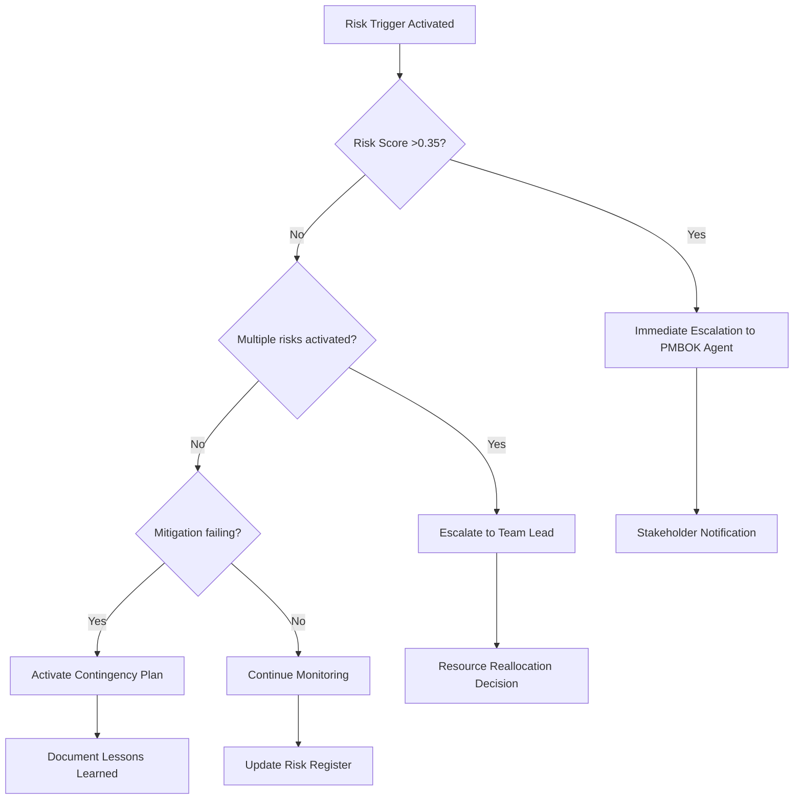

# Phase 2: Risk Assessment Dashboard Template
## Real-Time Risk Monitoring and Mitigation Tracking

### Dashboard Overview
This living document provides real-time risk monitoring, mitigation tracking, and early warning systems for Phase 2 of the test coverage improvement project.

---

## 1. EXECUTIVE RISK SUMMARY

### Risk Status Traffic Light
```
🟢 LOW RISK     : ≤2 active risks with score <0.20
🟡 MODERATE RISK: 3-5 active risks or any score 0.20-0.35
🔴 HIGH RISK    : >5 active risks or any score >0.35
```

**Current Status**: 🟡 MODERATE RISK
**Last Updated**: Day 8, 09:00 AM
**Next Review**: Day 8, 17:00 PM

### Quick Statistics
```yaml
Risk_Overview:
  Total_Identified_Risks: 5
  Active_Risks: 5
  Mitigated_Risks: 0
  Closed_Risks: 0
  
  Risk_Score_Distribution:
    High (>0.35): 1 risk
    Medium (0.20-0.35): 2 risks  
    Low (<0.20): 2 risks
    
  Response_Strategy_Distribution:
    Mitigate: 3 risks
    Transfer: 1 risk
    Accept: 1 risk
    Avoid: 0 risks
```

---

## 2. ACTIVE RISK REGISTER

### R-P2-001: Test Infrastructure Failures ⚠️ HIGH PRIORITY
```yaml
Risk_Profile:
  ID: "R-P2-001"
  Category: "Technical"
  Description: "Test infrastructure failures prevent coverage development"
  
Risk_Assessment:
  Probability: 0.40 (Medium)
  Impact: 0.80 (High) 
  Risk_Score: 0.32 (Medium-High)
  
Current_Status:
  Status: "ACTIVE - MONITORING"
  Trigger_Indicators:
    - Test success rate: 80.4% (Target: >95%)
    - Failing tests: 316 (Target: <50)
    - CI instability: Moderate
  
Mitigation_Strategy:
  Response_Type: "MITIGATE"
  Primary_Actions:
    - ✅ Daily backup of test configurations
    - 🔄 Incremental test addition (max 10 per commit)
    - 🔄 Automated rollback on CI failure
    
  Mitigation_Progress:
    Overall: 25% complete
    Backup_System: ✅ Implemented
    Incremental_Addition: 🔄 In progress
    Rollback_Automation: ⏳ Planned
    
  Contingency_Plan:
    Trigger: "Test success rate <75% for >24 hours"
    Action: "Revert to Phase 1 configuration, extend timeline +1 day"
    Resources: "All agents support infrastructure recovery"
    
Ownership:
  Risk_Owner: "Test Infrastructure Agent"
  Escalation_Contact: "PMBOK Agent"
  Review_Frequency: "Every 4 hours"
  
Monitoring_Metrics:
  KPI: "Test success rate improvement"
  Target: "80.4% → 95% over 2 days"
  Current_Trend: "Stable"
  Alert_Threshold: "<85% for >12 hours"
```

### R-P2-002: Branch Coverage Complexity ⚠️ MEDIUM PRIORITY
```yaml
Risk_Profile:
  ID: "R-P2-002"
  Category: "Schedule/Technical"
  Description: "Complex branch coverage improvements take longer than estimated"
  
Risk_Assessment:
  Probability: 0.60 (Medium-High)
  Impact: 0.60 (Medium)
  Risk_Score: 0.36 (Medium-High)
  
Current_Status:
  Status: "ACTIVE - HIGH WATCH"
  Trigger_Indicators:
    - Coverage improvement rate: TBD (Target: 2%/day)
    - Complex modules identified: ButtonCommand, Asset validation
    - Time estimation accuracy: Unknown
  
Mitigation_Strategy:
  Response_Type: "MITIGATE"
  Primary_Actions:
    - ⏳ Focus on high-impact, low-complexity branches first
    - ⏳ Time-box each improvement to 2 hours max
    - ⏳ Implement coverage tracking dashboard
    
  Mitigation_Progress:
    Overall: 10% complete
    Priority_Matrix: ⏳ Planned for Day 8
    Time_Boxing: ⏳ Process defined
    Dashboard: ⏳ Requirements gathering
    
  Contingency_Plan:
    Trigger: "Coverage improvement <1%/day for 2 consecutive days"
    Action: "Reduce targets to 65% overall, 55% branch coverage"
    Resources: "Reallocate agents to highest-impact areas"
    
Ownership:
  Risk_Owner: "Domain Testing Agent"
  Escalation_Contact: "PMBOK Agent"
  Review_Frequency: "Daily at 17:00"
  
Monitoring_Metrics:
  KPI: "Coverage points per day"
  Target: "2.0 percentage points/day"
  Current_Trend: "Not established"
  Alert_Threshold: "<1% for 2 days"
```

### R-P2-003: Test Flakiness Introduction ⚠️ MEDIUM PRIORITY
```yaml
Risk_Profile:
  ID: "R-P2-003"
  Category: "Quality"
  Description: "New tests introduce flakiness, reducing overall stability"
  
Risk_Assessment:
  Probability: 0.30 (Low-Medium)
  Impact: 0.70 (Medium-High)
  Risk_Score: 0.21 (Medium)
  
Current_Status:
  Status: "ACTIVE - MONITORING"
  Trigger_Indicators:
    - Flaky test count: 0 (Baseline established)
    - Test environment isolation: Partial
    - Concurrency issues: Unknown
  
Mitigation_Strategy:
  Response_Type: "MITIGATE"
  Primary_Actions:
    - ⏳ Mandatory test stability review process
    - ⏳ Isolated test environment setup  
    - ⏳ Automated flakiness detection system
    
  Mitigation_Progress:
    Overall: 5% complete
    Review_Process: ⏳ Template creation
    Isolation: ⏳ Environment analysis
    Detection: ⏳ Tool evaluation
    
  Contingency_Plan:
    Trigger: ">5 flaky tests introduced"
    Action: "Quarantine flaky tests, defer fixes to Phase 3"
    Resources: "QA Agent dedicated to stability analysis"
    
Ownership:
  Risk_Owner: "Quality Assurance Agent"
  Escalation_Contact: "PMBOK Agent"
  Review_Frequency: "Per test addition"
  
Monitoring_Metrics:
  KPI: "Flaky test introduction rate"
  Target: "0 new flaky tests"
  Current_Trend: "Baseline"
  Alert_Threshold: ">3 flaky tests"
```

### R-P2-004: Agent Expertise Gaps ⚠️ LOW PRIORITY
```yaml
Risk_Profile:
  ID: "R-P2-004"
  Category: "Resource"
  Description: "Agent expertise gaps in specialized areas slow progress"
  
Risk_Assessment:
  Probability: 0.40 (Medium)
  Impact: 0.50 (Medium)
  Risk_Score: 0.20 (Medium)
  
Current_Status:
  Status: "ACTIVE - LOW WATCH"
  Trigger_Indicators:
    - Performance testing: Limited experience
    - Complex Jest configuration: Moderate gaps
    - Coverage analysis: Training needed
  
Mitigation_Strategy:
  Response_Type: "TRANSFER"
  Primary_Actions:
    - ⏳ Cross-training sessions between agents
    - ⏳ External consultant on standby
    - ⏳ Knowledge sharing documentation
    
  Mitigation_Progress:
    Overall: 15% complete
    Cross_Training: ⏳ Schedule being created
    Consultant: ✅ Contact identified
    Documentation: ⏳ Template prepared
    
  Contingency_Plan:
    Trigger: "Agent blocked >4 hours on expertise gap"
    Action: "Immediate knowledge transfer session or external support"
    Resources: "Consultant engagement, agent reallocation"
    
Ownership:
  Risk_Owner: "PMBOK Agent"
  Escalation_Contact: "Development Team Lead"
  Review_Frequency: "Weekly"
  
Monitoring_Metrics:
  KPI: "Knowledge gap resolution time"
  Target: "<4 hours per gap"
  Current_Trend: "Not established"
  Alert_Threshold: ">8 hours blocked"
```

### R-P2-005: CI/CD Pipeline Overload ⚠️ LOW PRIORITY
```yaml
Risk_Profile:
  ID: "R-P2-005"
  Category: "Technical"
  Description: "Increased test volume overloads CI/CD pipeline, causing delays"
  
Risk_Assessment:
  Probability: 0.20 (Low)
  Impact: 0.90 (High)
  Risk_Score: 0.18 (Low)
  
Current_Status:
  Status: "ACTIVE - ACCEPT & MONITOR"
  Trigger_Indicators:
    - Current CI time: ~25 seconds (Target: <60 seconds)
    - Pipeline capacity: Unknown
    - Concurrent job limits: Not reached
  
Mitigation_Strategy:
  Response_Type: "ACCEPT"
  Primary_Actions:
    - 📊 Monitor CI performance metrics
    - 📋 Document pipeline optimization opportunities
    - 🔄 Implement batched test execution if needed
    
  Mitigation_Progress:
    Overall: 20% complete
    Monitoring: ✅ Metrics collection active
    Documentation: ⏳ Baseline established
    Batching: ⏳ Fallback plan prepared
    
  Contingency_Plan:
    Trigger: "CI execution time >90 seconds consistently"
    Action: "Implement test batching, pipeline optimization"
    Resources: "Test Infrastructure Agent, 0.5 day effort"
    
Ownership:
  Risk_Owner: "Test Infrastructure Agent"
  Escalation_Contact: "PMBOK Agent"
  Review_Frequency: "Daily"
  
Monitoring_Metrics:
  KPI: "CI execution time"
  Target: "<60 seconds"
  Current_Trend: "Stable"
  Alert_Threshold: ">90 seconds for >4 hours"
```

---

## 3. RISK MONITORING DASHBOARD

### 3.1 Real-Time Risk Indicators

```yaml
Risk_Health_Dashboard:
  Overall_Risk_Score: 0.254  # Weighted average of all active risks
  Risk_Trend: "STABLE"       # IMPROVING/STABLE/DECLINING
  
  Critical_Indicators:
    High_Priority_Risks: 1    # Score >0.35
    Medium_Priority_Risks: 2  # Score 0.20-0.35
    Overdue_Mitigations: 0    # Actions past due date
    
  Early_Warning_Signals:
    Test_Success_Rate: 80.4%  # Threshold: <85%
    Coverage_Improvement: TBD  # Threshold: <1%/day
    CI_Performance: 25s        # Threshold: >60s
    Agent_Utilization: TBD     # Threshold: <80%
    
  Risk_Response_Effectiveness:
    Mitigations_On_Track: 60%  # Actions progressing as planned
    Contingency_Readiness: 80% # Plans ready for activation
    Escalation_Response: 100%  # Issues escalated within SLA
```

### 3.2 Risk Trend Analysis

#### Historical Risk Score Tracking
```
Day 8:  Risk Score = 0.254 (Baseline)
Day 9:  Risk Score = TBD
Day 10: Risk Score = TBD
Day 11: Risk Score = TBD
Day 12: Risk Score = TBD
Day 13: Risk Score = TBD
Day 14: Risk Score = TBD

Target: Risk Score <0.20 by Day 14
```

#### Risk Velocity Tracking
```yaml
Risk_Velocity_Metrics:
  New_Risks_Per_Day: 0       # Target: <1 per day
  Closed_Risks_Per_Day: 0    # Target: >1 per day after Day 10
  Risk_Response_Time: TBD    # Target: <4 hours for medium+ risks
  Mitigation_Effectiveness: TBD # Target: 80% of mitigations successful
```

---

## 4. EARLY WARNING SYSTEM

### 4.1 Automated Alerts

#### Critical Alerts (Immediate Response Required)
```yaml
Critical_Alert_Triggers:
  Test_Infrastructure_Failure:
    Condition: "Test success rate <75% for >2 hours"
    Notification: "Immediate Slack alert to all agents"
    Response_Time: "30 minutes"
    
  Coverage_Stagnation:
    Condition: "Coverage improvement <0.5%/day for >24 hours"
    Notification: "Email + Slack to PMBOK Agent"
    Response_Time: "2 hours"
    
  CI_Pipeline_Failure:
    Condition: "CI time >120 seconds or >50% failure rate"
    Notification: "Immediate alert to Test Infrastructure Agent"
    Response_Time: "1 hour"
```

#### Warning Alerts (Proactive Monitoring)
```yaml
Warning_Alert_Triggers:
  Risk_Score_Increase:
    Condition: "Overall risk score increases >0.05 in 24 hours"
    Notification: "Daily summary to stakeholders"
    Response_Time: "Next business day"
    
  Mitigation_Delays:
    Condition: "Any mitigation action >24 hours overdue"
    Notification: "Alert to risk owner + PMBOK Agent"
    Response_Time: "4 hours"
    
  Quality_Gate_Warning:
    Condition: "Any quality gate at 80-90% of failure threshold"
    Notification: "QA Agent + relevant specialist agent"
    Response_Time: "8 hours"
```

### 4.2 Predictive Risk Analytics

#### Risk Probability Modeling
```python
# Pseudo-code for risk probability updates
def update_risk_probability(risk_id, current_indicators):
    """Update risk probability based on leading indicators"""
    
    base_probability = risk_register[risk_id].base_probability
    
    # Factor in trend indicators
    trend_factor = calculate_trend_impact(current_indicators)
    
    # Factor in mitigation effectiveness  
    mitigation_factor = assess_mitigation_effectiveness(risk_id)
    
    # Calculate adjusted probability
    adjusted_probability = base_probability * trend_factor * mitigation_factor
    
    return min(1.0, max(0.0, adjusted_probability))
```

#### Leading Indicator Tracking
```yaml
Leading_Indicators:
  For_Test_Infrastructure_Risk:
    - Test_Success_Rate_Trend: "Daily measurement"
    - Failed_Test_Count: "Real-time tracking"
    - CI_Job_Queue_Length: "Hourly monitoring"
    
  For_Coverage_Complexity_Risk:
    - Lines_Added_Per_Hour: "Hourly tracking"
    - Complex_Module_Progress: "Daily assessment"
    - Time_Estimation_Variance: "Per-task measurement"
    
  For_Flakiness_Risk:
    - Test_Stability_Metrics: "Per-commit tracking"
    - Environment_Isolation_Score: "Daily assessment"
    - Concurrency_Error_Rate: "Real-time monitoring"
```

---

## 5. CONTINGENCY ACTIVATION MATRIX

### 5.1 Contingency Readiness Status

| Risk ID | Contingency Plan Status | Activation Trigger Met? | Resources Available? | Activation Time |
|---------|------------------------|-------------------------|---------------------|-----------------|
| R-P2-001 | ✅ Ready | ❌ No (Success rate: 80.4%) | ✅ Yes | 2 hours |
| R-P2-002 | ⏳ 50% Ready | ❌ TBD | ✅ Yes | 4 hours |
| R-P2-003 | ⏳ 25% Ready | ❌ No (0 flaky tests) | ✅ Yes | 8 hours |
| R-P2-004 | ✅ Ready | ❌ No | ✅ Yes | 4 hours |
| R-P2-005 | ✅ Ready | ❌ No (CI: 25s) | ✅ Yes | 1 hour |

### 5.2 Escalation Decision Tree



---

## 6. RISK COMMUNICATION PLAN

### 6.1 Stakeholder Risk Communication Matrix

| Stakeholder | Risk Level | Communication Method | Frequency | Content Detail |
|-------------|------------|---------------------|-----------|----------------|
| Development Team | All risks | Slack/Discord | Real-time | Technical details |
| PMBOK Agent | Medium+ risks | Direct notification | Within 4 hours | Full analysis |
| Product Owner | High risks only | Email summary | Daily digest | Impact summary |
| QA Team | Quality-related | Dashboard + Slack | Real-time | Quality metrics |

### 6.2 Risk Report Templates

#### Daily Risk Summary Email
```
Subject: Phase 2 Risk Status - Day [X] - [Risk Level]

EXECUTIVE SUMMARY:
- Overall Risk Level: [🟢/🟡/🔴]
- Active High-Priority Risks: [Count]
- New Risks Identified: [Count]
- Risks Closed: [Count]

RISK STATUS CHANGES:
- [Risk ID]: [Status change description]

ACTION REQUIRED:
- [Any immediate actions needed from stakeholders]

NEXT REVIEW: [Date/Time]
```

#### Weekly Risk Deep Dive
```
WEEKLY RISK ANALYSIS - Week [X]

RISK TRENDS:
- Overall risk score trend: [Direction and analysis]
- Most improved risk: [Analysis]
- Risk requiring attention: [Analysis]

MITIGATION EFFECTIVENESS:
- Successful mitigations: [Count and success rate]
- Ineffective mitigations: [Analysis and corrective actions]

PREDICTIVE ANALYSIS:
- Risks likely to emerge next week: [Predictions]
- Recommended proactive actions: [Recommendations]

LESSONS LEARNED:
- Key insights from this week: [3-5 bullet points]
```

---

## 7. RISK MITIGATION TRACKING

### 7.1 Mitigation Action Status Board

#### R-P2-001 Mitigation Actions
```yaml
Action_1_Daily_Backups:
  Status: "✅ COMPLETE"
  Owner: "Test Infrastructure Agent"
  Due_Date: "Day 8 EOD"
  Completion_Date: "Day 8, 14:00"
  Effectiveness: "High - Recovery time reduced to <1 hour"
  
Action_2_Incremental_Addition:
  Status: "🔄 IN PROGRESS"
  Owner: "Test Infrastructure Agent"
  Due_Date: "Day 9 EOD"
  Progress: "75% - Process documented, automation 50% complete"
  Next_Milestone: "Automation script completion"
  
Action_3_Automated_Rollback:
  Status: "⏳ PLANNED"
  Owner: "Test Infrastructure Agent"
  Due_Date: "Day 10 EOD"  
  Dependencies: "Action_2 completion"
  Resource_Requirements: "4 hours development time"
```

#### Cross-Risk Mitigation Coordination
```yaml
Shared_Mitigations:
  Coverage_Dashboard:
    Affects_Risks: ["R-P2-002", "R-P2-003"]
    Lead_Agent: "QA Agent"
    Supporting_Agents: ["Domain Testing Agent", "Integration Agent"]
    Status: "🔄 IN PROGRESS"
    Completion: "60%"
    
  Agent_Cross_Training:
    Affects_Risks: ["R-P2-004"]
    Lead_Agent: "PMBOK Agent"
    Supporting_Agents: ["All Agents"]
    Status: "⏳ PLANNED"
    Schedule: "Day 9, 16:00-17:00"
```

---

## 8. CONTINUOUS IMPROVEMENT

### 8.1 Risk Management Effectiveness Metrics

```yaml
Risk_Management_KPIs:
  Predictive_Accuracy:
    Metric: "% of materialized risks that were predicted"
    Target: ">80%"
    Current: "Baseline being established"
    
  Response_Efficiency:
    Metric: "Average time from risk identification to mitigation start"
    Target: "<4 hours for medium+ risks"
    Current: "TBD"
    
  Mitigation_Success_Rate:
    Metric: "% of mitigations that successfully reduce risk score"
    Target: ">75%"
    Current: "TBD"
    
  Risk_Prevention:
    Metric: "% of identified risks that never materialize"
    Target: ">60%"
    Current: "TBD"
```

### 8.2 Process Improvement Opportunities

#### Weekly Risk Process Review
```yaml
Weekly_Review_Agenda:
  Time: "Day 14, 16:00-17:00"
  Participants: ["PMBOK Agent", "All Agent Leads", "QA Agent"]
  
  Review_Topics:
    - Risk identification effectiveness
    - Mitigation strategy success rates
    - Communication process efficiency
    - Tool and template improvements
    
  Outputs:
    - Process improvement recommendations
    - Updated risk templates
    - Enhanced monitoring procedures
    - Phase 3 risk management plan inputs
```

---

## DASHBOARD FOOTER

**Last Updated**: Day 8, Phase 2 - 09:00 AM
**Next Scheduled Update**: Day 8 - 17:00 PM (Daily)
**Risk Review Meeting**: Day 8 - 17:30 PM
**Document Owner**: PMBOK Agent
**Distribution**: All Phase 2 Agents, Stakeholders

**Quick Reference Links**:
- [Phase 2 Project Plan](PHASE2-PROJECT-PLAN.md)
- [Agent Coordination Matrix](PHASE2-AGENT-MATRIX.md)
- [Quality Gates Dashboard](TBD)
- [Coverage Tracking Dashboard](TBD)

**Emergency Contacts**:
- PMBOK Agent: Immediate (Slack/Discord)
- Test Infrastructure Agent: <4 hours (Technical issues)
- Quality Assurance Agent: <8 hours (Quality concerns)
- Development Team Lead: Same day (Resource/scope issues)