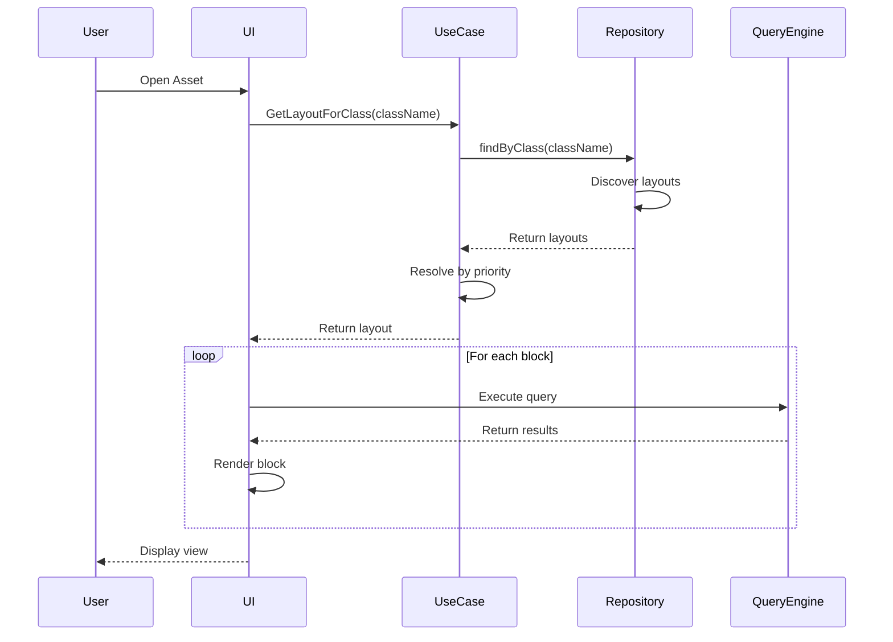
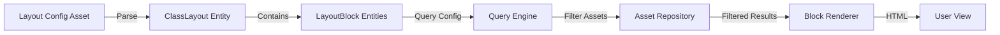

# ADR-003: Class-Based Layout System Architecture

## Status

Proposed

## Context

Users need different views for different types of assets. A Project should show its tasks, an Area should show sub-areas, etc. The current fixed layout doesn't adapt to the asset's class context.

## Decision

Implement a configuration-driven layout system where layouts are defined as assets (`ui__ClassLayout`) in the user's knowledge base.

## Architecture

### Layered Architecture

```
┌──────────────────────────────────────────────┐
│            Presentation Layer                │
│                                              │
│  ┌──────────────────────────────────────┐   │
│  │        LayoutRenderer                │   │
│  │  ┌─────────┐ ┌─────────┐ ┌────────┐│   │
│  │  │ Query   │ │Property│ │Relation││   │
│  │  │ Block   │ │ Block  │ │ Block  ││   │
│  │  └─────────┘ └─────────┘ └────────┘│   │
│  └──────────────────────────────────────┘   │
└──────────────────────────────────────────────┘
                        │
┌──────────────────────────────────────────────┐
│           Application Layer                  │
│                                              │
│  ┌──────────────────────────────────────┐   │
│  │    GetLayoutForClassUseCase          │   │
│  │    ExecuteQueryBlockUseCase          │   │
│  │    ValidateLayoutUseCase             │   │
│  └──────────────────────────────────────┘   │
└──────────────────────────────────────────────┘
                        │
┌──────────────────────────────────────────────┐
│              Domain Layer                    │
│                                              │
│  ┌──────────────┐  ┌──────────────────┐    │
│  │ ClassLayout  │  │   LayoutBlock    │    │
│  │   Entity     │  │     Entity       │    │
│  └──────────────┘  └──────────────────┘    │
└──────────────────────────────────────────────┘
                        │
┌──────────────────────────────────────────────┐
│          Infrastructure Layer                │
│                                              │
│  ┌──────────────────────────────────────┐   │
│  │  ObsidianClassLayoutRepository       │   │
│  │  QueryEngine                         │   │
│  │  LayoutDiscoveryService              │   │
│  └──────────────────────────────────────┘   │
└──────────────────────────────────────────────┘
```

### Component Interactions



### Data Flow



## Design Patterns Used

### 1. Strategy Pattern

Different block types (query, properties, relations) implement a common rendering interface.

### 2. Repository Pattern

Abstracts layout storage and retrieval through `IClassLayoutRepository`.

### 3. Factory Pattern

Creates appropriate block renderers based on block type.

### 4. Chain of Responsibility

Layout resolution follows priority chain until matching layout found.

### 5. Template Method

Base block renderer defines rendering steps, subclasses implement specifics.

## Key Design Decisions

### 1. Configuration as Assets

**Decision:** Store layouts as regular assets with `ui__ClassLayout` class.
**Rationale:**

- Leverages existing asset system
- Version controlled with knowledge base
- Searchable and linkable
- No separate configuration files

### 2. Block-Based Composition

**Decision:** Layouts composed of independent blocks.
**Rationale:**

- Modularity and reusability
- Easy to add new block types
- Flexible ordering
- Progressive enhancement

### 3. Query DSL

**Decision:** Use structured query configuration instead of raw queries.
**Rationale:**

- Type safety
- Validation possible
- UI generation potential
- Security (no arbitrary code execution)

### 4. Priority-Based Resolution

**Decision:** Support multiple layouts per class with priority.
**Rationale:**

- Allows overrides
- Supports specialization
- Enables A/B testing
- Graceful fallbacks

## Performance Considerations

### Caching Strategy

```typescript
interface LayoutCache {
  layouts: Map<ClassName, ClassLayout[]>;
  queryResults: Map<QueryHash, Asset[]>;
  ttl: number;
}
```

### Query Optimization

- Batch similar queries
- Cache query results
- Implement pagination
- Use indexes for common filters

### Rendering Optimization

- Virtual scrolling for large lists
- Lazy load blocks below fold
- Debounce re-renders
- Memoize expensive computations

## Security Considerations

### Input Validation

- Validate all query configurations
- Sanitize property values
- Prevent injection attacks
- Limit query complexity

### Access Control

- Respect Obsidian file permissions
- Filter results by user access
- No direct file system access
- Sandbox custom scripts

## Extensibility Points

### New Block Types

```typescript
interface IBlockRenderer {
  canRender(block: LayoutBlock): boolean;
  render(block: LayoutBlock, context: RenderContext): Promise<HTMLElement>;
}
```

### Custom Query Operators

```typescript
interface IQueryOperator {
  name: string;
  evaluate(propertyValue: any, filterValue: any): boolean;
}
```

### Layout Transformers

```typescript
interface ILayoutTransformer {
  transform(layout: ClassLayout, context: AssetContext): ClassLayout;
}
```

## Migration Path

### Phase 1: Core Implementation

- Basic layout entities
- Simple query blocks
- Repository implementation

### Phase 2: Enhanced Blocks

- Property editing
- Relation navigation
- Custom blocks

### Phase 3: Advanced Features

- Layout inheritance
- Conditional blocks
- Performance optimization

### Phase 4: User Experience

- Visual configuration
- Layout templates
- Migration wizard

## Consequences

### Positive

- Highly flexible view system
- User-controlled configuration
- Extensible architecture
- Performance optimized
- Maintains Clean Architecture

### Negative

- Initial complexity for users
- Learning curve for configuration
- Potential performance issues with complex queries
- More code to maintain

### Neutral

- Requires documentation
- Changes existing workflow
- New dependencies

## Alternatives Considered

### 1. Hardcoded Views

**Rejected:** Not flexible enough for diverse use cases.

### 2. External Configuration Files

**Rejected:** Adds complexity, breaks single source of truth.

### 3. Plugin-Based System

**Rejected:** Too complex for users to extend.

### 4. Template Files

**Rejected:** Less flexible than structured configuration.

## References

- Clean Architecture principles
- Obsidian Plugin API
- React rendering patterns
- Query DSL design patterns
