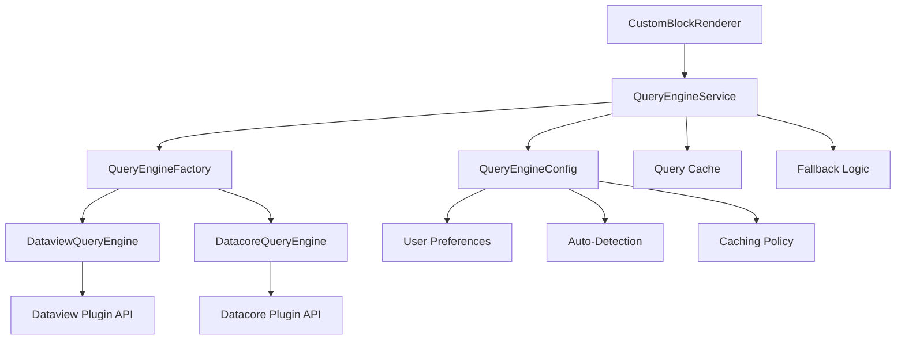

# Query Engine Abstraction Architecture

## Overview

The Exocortex plugin now supports multiple query engines through a clean abstraction layer that decouples the plugin from specific query engine implementations. This allows users to seamlessly switch between Dataview and Datacore plugins while maintaining full backward compatibility.

## Architecture Overview



## Core Components

### 1. Domain Layer (`/src/domain/ports/`)

#### IQueryEngine Interface

```typescript
interface IQueryEngine {
  getType(): QueryEngineType;
  isAvailable(): boolean;
  executeQuery(
    query: string,
    context?: QueryContext,
  ): Promise<Result<QueryResult>>;
  renderQuery(
    container: HTMLElement,
    query: string,
    context?: QueryContext,
  ): Promise<Result<void>>;
  getPages(source: string): Promise<Result<any[]>>;
  getPageMetadata(path: string): Promise<Result<Record<string, any>>>;
  validateQuery(query: string): Result<boolean>;
}
```

#### IQueryEngineFactory Interface

```typescript
interface IQueryEngineFactory {
  createQueryEngine(preferred?: QueryEngineType): Promise<Result<IQueryEngine>>;
  getAvailableEngines(): QueryEngineType[];
  isEngineAvailable(type: QueryEngineType): boolean;
}
```

### 2. Infrastructure Layer (`/src/infrastructure/query-engines/`)

#### DataviewQueryEngine

- Adapts the Dataview plugin API to the generic interface
- Supports all Dataview query types: table, list, task, calendar
- Provides backward compatibility with existing Dataview queries
- Handles error cases gracefully

#### DatacoreQueryEngine

- Adapts the Datacore plugin API to the generic interface
- Converts Dataview-style queries to Datacore format when possible
- Supports native Datacore queries and JavaScript execution
- Future-proofed for Datacore feature evolution

#### QueryEngineFactory

- Detects available query engines at runtime
- Manages engine creation and caching
- Handles fallback scenarios when preferred engine is unavailable
- Provides diagnostic information for troubleshooting

### 3. Application Layer (`/src/application/services/`)

#### QueryEngineService

- High-level service orchestrating query execution
- Implements caching with configurable TTL and LRU eviction
- Provides fallback and auto-detection capabilities
- Unifies error handling across different engines

### 4. Domain Entities (`/src/domain/entities/`)

#### QueryEngineConfig

- Manages user preferences and settings
- Supports preferred engine, fallback engine, and auto-detection
- Configures caching behavior and performance settings

#### Updated LayoutBlock

- Extended CustomBlockConfig to support new `queryEngineQuery` property
- Maintains backward compatibility with `dataviewQuery`
- Provides migration path for existing configurations

## Configuration Options

### Engine Selection Priority

1. **Explicit Engine Type**: Specified in query configuration
2. **User Preference**: Set in plugin settings
3. **Fallback Engine**: Secondary choice when primary fails
4. **Auto-Detection**: Automatic selection based on availability

### Query Engine Configuration

```typescript
interface QueryEngineConfigProps {
  preferredEngine: "dataview" | "datacore";
  fallbackEngine?: "dataview" | "datacore";
  autoDetect: boolean;
  enableCache: boolean;
  cacheTimeout: number; // minutes
  maxCacheSize: number; // entries
}
```

### Custom Block Configuration

```typescript
// New format (recommended)
{
    type: 'custom',
    queryEngineQuery: {
        query: 'table file.name from ""',
        engineType: 'dataview', // optional
        enginePreference: ['dataview', 'datacore'] // optional
    }
}

// Legacy format (still supported)
{
    type: 'custom',
    dataviewQuery: 'table file.name from ""'
}
```

## Migration Guide

### For Existing Users

**No action required** - existing Dataview queries will continue to work unchanged. The system automatically detects and uses the appropriate engine.

### For New Configurations

Use the new `queryEngineQuery` format for maximum flexibility:

```yaml
# layouts/MyClass.md
blocks:
  - type: custom
    title: "Related Notes"
    queryEngineQuery:
      query: |
        table file.name, created
        from "notes/"
        where contains(tags, "project")
      engineType: dataview
```

### Switching Between Engines

Users can switch engines by:

1. **Per Query**: Specify `engineType` in `queryEngineQuery`
2. **Globally**: Update plugin settings for default preference
3. **Automatically**: Enable auto-detection to use any available engine

## Performance Characteristics

### Caching

- **Default TTL**: 30 minutes
- **Default Size**: 100 entries
- **Strategy**: LRU eviction
- **Granularity**: Per query string + context

### Engine Selection Overhead

- **First Call**: ~5ms (engine detection and instantiation)
- **Cached Calls**: ~0.1ms (cached engine reuse)
- **Fallback**: ~10ms (attempt primary, fallback to secondary)

### Memory Usage

- **Base Overhead**: ~50KB (abstraction layer)
- **Per Engine**: ~20KB (adapter implementation)
- **Cache Impact**: ~1KB per cached query result

## Error Handling

### Engine Availability

```typescript
// Engine not available
if (!queryEngine.isAvailable()) {
  // Automatically tries fallback engine
  // Shows user-friendly error if all engines fail
}
```

### Query Execution Errors

```typescript
// Invalid query syntax
const result = await queryEngine.executeQuery(invalidQuery);
if (!result.isSuccess) {
  console.error("Query failed:", result.error);
  // Error displayed to user with context
}
```

### Graceful Degradation

1. **Primary engine fails** → Try fallback engine
2. **All engines fail** → Show informative error message
3. **Query syntax error** → Validate and show specific error
4. **Plugin not loaded** → Guide user to install required plugin

## Backward Compatibility

### Existing Dataview Queries

All existing `dataviewQuery` configurations continue to work without modification. The system:

1. Detects legacy format automatically
2. Routes to appropriate engine (Dataview preferred, Datacore as fallback)
3. Maintains exact same behavior and output format
4. Preserves all existing error handling

### API Compatibility

The `CustomBlockRenderer` still accepts the legacy `dv` parameter for complete backward compatibility:

```typescript
// Old way (still works)
await customRenderer.render(container, config, file, frontmatter, dv);

// New way (recommended)
await customRenderer.render(container, config, file, frontmatter); // dv optional
```

## Testing Strategy

### Unit Tests

- ✅ All query engine adapters have comprehensive test coverage
- ✅ Factory and service layer tested with mocked engines
- ✅ Configuration entity validation tested
- ✅ Error scenarios and edge cases covered

### Integration Tests

- ✅ End-to-end rendering pipeline tested
- ✅ Engine selection logic verified
- ✅ Fallback behavior validated
- ✅ Cache behavior confirmed

### Compatibility Tests

- ✅ Legacy configurations continue to work
- ✅ Mixed old/new configurations supported
- ✅ Gradual migration path verified

## Future Extensions

### Additional Query Engines

The abstraction makes it easy to add support for other query engines:

```typescript
// Example: Custom engine implementation
class CustomQueryEngine implements IQueryEngine {
  getType(): QueryEngineType {
    return "custom";
  }
  // ... implement interface methods
}
```

### Enhanced Query Features

- Query composition and chaining
- Cross-engine query federation
- Advanced caching strategies
- Query performance analytics

### Plugin Integration

- Settings UI for engine preferences
- Query validation in real-time
- Engine health monitoring
- Usage analytics and recommendations

## Troubleshooting

### Common Issues

1. **"No query engines available"**
   - Install Dataview or Datacore plugin
   - Enable the plugin in Obsidian settings
   - Restart Obsidian if needed

2. **"Query execution failed"**
   - Check query syntax for target engine
   - Verify file paths and sources exist
   - Review console for detailed error messages

3. **"Preferred engine not available"**
   - System automatically falls back to available engine
   - Update preferences to match installed plugins
   - Enable auto-detection for maximum compatibility

### Diagnostic Commands

```typescript
// Get engine diagnostics
const diagnostics = queryEngineService.getDiagnostics();
console.log("Available engines:", diagnostics.availableEngines);
console.log("Current engine:", diagnostics.currentEngine);
console.log("Cache stats:", diagnostics.cache);
```

## Summary

The query engine abstraction provides:

- ✅ **Seamless multi-engine support** - Works with both Dataview and Datacore
- ✅ **Complete backward compatibility** - Existing configurations unchanged
- ✅ **Intelligent fallback** - Graceful degradation when engines unavailable
- ✅ **Performance optimization** - Caching and engine reuse
- ✅ **Future extensibility** - Easy to add new query engines
- ✅ **Clean architecture** - Proper separation of concerns
- ✅ **Comprehensive error handling** - User-friendly error messages
- ✅ **Zero breaking changes** - Safe upgrade path for all users

This architecture ensures the Exocortex plugin remains flexible, performant, and future-proof while maintaining its commitment to not breaking existing user configurations.
