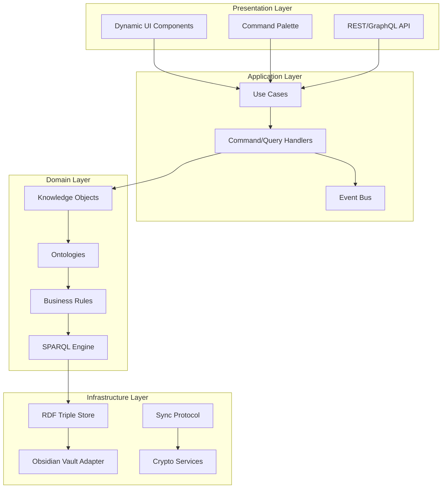

# Exocortex Semantic Architecture Vision

## Executive Summary

The Exocortex represents a revolutionary **semantic knowledge management platform** that augments human cognitive capabilities through AI-assisted reasoning and knowledge organization. This document outlines the architectural vision for transforming the current implementation into a truly semantic, privacy-first, and extensible cognitive prosthesis.

## Core Philosophy

> "Transforming daily routine into daily adventure through semantic augmentation of human cognition"

The Exocortex is not merely a productivity tool but a **cognitive companion** that:

- Extends human memory through semantic knowledge graphs
- Enables complex reasoning through SPARQL queries
- Preserves absolute privacy through cryptographic architecture
- Evolves with the user through ontology-driven extensibility

## Architectural Principles

### 1. Semantic-First Design

- **RDF/OWL** as the foundational data model
- **SPARQL 1.1** for querying and reasoning
- **SHACL** for data validation
- **Ontology-driven** UI and behavior

### 2. Privacy by Architecture

- **UUID-only public exposure** - all data remains private
- **Cryptographic access control** at the property level
- **Zero-knowledge** protocol design
- **Local-first** with optional selective sync

### 3. Clean Architecture & DDD

- **Hexagonal architecture** with clear boundaries
- **Domain-driven design** with rich domain models
- **CQRS** for read/write separation
- **Event sourcing** for temporal reasoning

### 4. Extensibility Through Ontologies

- **Plugin-as-ontology** architecture
- **Semantic interoperability** between plugins
- **Inheritance hierarchies** for knowledge reuse
- **Versioned evolution** with migration paths

## System Architecture



## Core Components

### 1. Knowledge Object System

```typescript
interface KnowledgeObject {
  uuid: UUID; // Globally unique identifier
  type: IRI; // Ontology class reference
  properties: Map<IRI, Value>; // Semantic properties
  relations: Map<IRI, UUID[]>; // Semantic relationships
  content?: MarkdownContent; // Optional content body
}
```

### 2. Ontology Management

```typescript
interface Ontology {
  namespace: IRI;
  prefix: string;
  classes: Map<IRI, ClassDefinition>;
  properties: Map<IRI, PropertyDefinition>;
  rules: SHACL.Shape[];
  version: SemanticVersion;
}
```

### 3. Privacy Layer

```typescript
interface PrivacyAdapter {
  encrypt(data: any, level: PrivacyLevel): EncryptedData;
  decrypt(data: EncryptedData, key: CryptoKey): any;
  share(uuid: UUID, properties: IRI[], recipient: PublicKey): ShareToken;
  revoke(token: ShareToken): void;
}
```

### 4. Reasoning Engine

```typescript
interface ReasoningEngine {
  query(sparql: string): ResultSet;
  infer(rules: OWL.Axiom[]): Triple[];
  validate(data: Graph, shapes: SHACL.Shape[]): ValidationReport;
  explain(conclusion: Triple): ProofTree;
}
```

## Implementation Phases

### Phase 1: Semantic Foundation (Current)

- Core ontology implementation (exo, ems, ims)
- RDF triple store integration
- Basic SPARQL querying
- UUID-based identity system

### Phase 2: Advanced Reasoning

- OWL DL inference engine
- SHACL validation
- Temporal reasoning with event sourcing
- Pattern detection algorithms

### Phase 3: Privacy & Distribution

- End-to-end encryption
- Selective property sharing
- CRDT-based sync protocol
- Federated query execution

### Phase 4: Intelligence Layer

- ML-based pattern recognition
- Suggestion engine
- Predictive planning
- Natural language querying

## Technology Stack

### Core Technologies

- **TypeScript 5.0+** - Type-safe development
- **RDF.js** - RDF data model
- **Comunica** - SPARQL query engine
- **N3.js** - RDF parsing/serialization
- **SHACL.js** - Data validation

### Infrastructure

- **Obsidian API** - Vault integration
- **IndexedDB** - Local triple store
- **WebCrypto** - Encryption services
- **Automerge** - CRDT implementation

### Development Tools

- **Jest** - Unit testing
- **Playwright** - E2E testing
- **ESBuild** - Fast bundling
- **GitHub Actions** - CI/CD

## Quality Attributes

### Performance

- Sub-100ms query response for common operations
- Lazy loading for large knowledge graphs
- Incremental indexing for real-time updates
- Memory-efficient triple storage

### Security

- Zero-knowledge architecture
- End-to-end encryption for sync
- Cryptographic access control
- Audit logging for sensitive operations

### Usability

- Progressive disclosure from simple to expert
- Context-aware UI adaptation
- Keyboard-first navigation
- Accessible design (WCAG 2.1 AA)

### Extensibility

- Plugin API with sandboxing
- Custom ontology support
- Theme system for UI customization
- Webhook integration for automation

## Success Metrics

### Technical Metrics

- 90%+ test coverage
- <10 cyclomatic complexity
- Zero critical security vulnerabilities
- <5% performance regression per release

### User Metrics

- <5 minute onboarding time
- 80%+ feature discoverability
- <1% data loss rate
- 95%+ uptime for sync services

### Business Metrics

- 1000+ active users in 6 months
- 10+ community plugins
- 5+ professional ontologies
- 50%+ user retention after 3 months

## Migration Strategy

### From Current to Target Architecture

1. **Parallel Implementation**
   - New features use semantic architecture
   - Legacy features wrapped in adapters
   - Gradual migration of existing data

2. **Data Migration**
   - Automatic conversion to RDF on first load
   - Backward compatibility for 3 versions
   - Export/import tools for manual migration

3. **User Experience**
   - Opt-in to new features
   - Visual indicators for semantic features
   - Comprehensive migration guide
   - Community support channels

## Risk Mitigation

### Technical Risks

- **Complexity**: Mitigated through incremental delivery
- **Performance**: Addressed with caching and indexing
- **Compatibility**: Maintained through adapter pattern

### User Risks

- **Learning Curve**: Progressive disclosure and tutorials
- **Data Loss**: Comprehensive backup and recovery
- **Privacy Concerns**: Transparent security model

## Conclusion

This architectural vision positions the Exocortex as a pioneering platform for augmented cognition, combining cutting-edge semantic technologies with pragmatic software engineering practices. By adhering to these principles and following the outlined implementation path, we will create a system that truly extends human cognitive capabilities while preserving privacy and enabling collective intelligence.

The journey from a productivity tool to a cognitive prosthesis begins with this architectural transformation.
