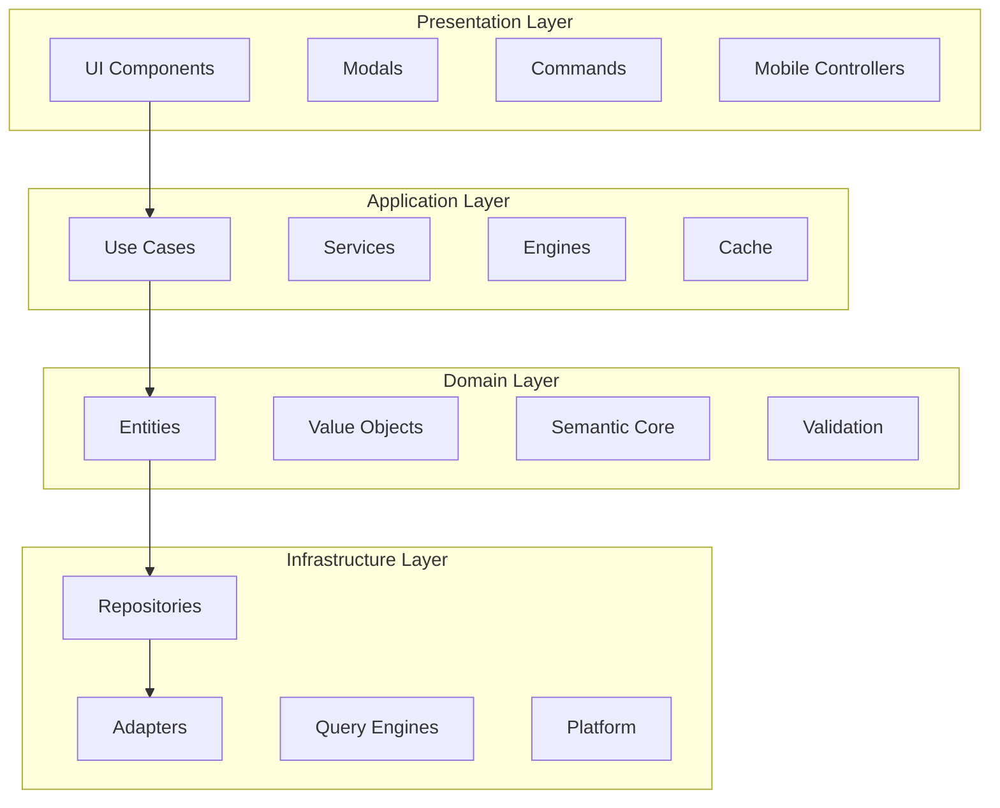

# Technical Specification Document
## Exocortex Knowledge Management System

**Document Version:** 1.0.0  
**Date:** 2025-08-23  
**Standard:** IEEE 830-1998, IEEE 1016-2009  
**Status:** AS-BUILT SPECIFICATION

---

## 1. SYSTEM OVERVIEW

### 1.1 Purpose
This document provides the technical specification for the implemented Exocortex Knowledge Management System, an Obsidian plugin that provides semantic web capabilities through RDF/OWL/SPARQL technologies.

### 1.2 Scope
The system encompasses:
- Semantic web engine (RDF/OWL/SPARQL)
- Asset management system
- Query engine abstraction layer
- Mobile platform support
- User interface components

### 1.3 Architecture Overview



## 2. TECHNICAL ARCHITECTURE

### 2.1 System Components

#### 2.1.1 Domain Layer Components

| Component | Type | Responsibility | Location |
|-----------|------|---------------|----------|
| Asset | Entity | Asset lifecycle management | `/domain/entities/Asset.ts` |
| Task | Entity | Task management | `/domain/entities/Task.ts` |
| ClassLayout | Entity | Layout definitions | `/domain/entities/ClassLayout.ts` |
| Ontology | Entity | Ontology management | `/domain/entities/Ontology.ts` |
| AssetId | Value Object | Asset identification | `/domain/value-objects/AssetId.ts` |
| PropertyValue | Value Object | Property values | `/domain/value-objects/PropertyValue.ts` |
| IndexedGraph | Core | RDF triple store | `/domain/semantic/core/IndexedGraph.ts` |
| Triple | Core | RDF triple | `/domain/semantic/core/Triple.ts` |

#### 2.1.2 Application Layer Components

| Component | Type | Responsibility | Location |
|-----------|------|---------------|----------|
| SPARQLEngine | Engine | SPARQL query execution | `/application/SPARQLEngine.ts` |
| QueryCache | Service | Query result caching | `/application/services/QueryCache.ts` |
| CreateAssetUseCase | Use Case | Asset creation | `/application/use-cases/CreateAssetUseCase.ts` |
| PropertyEditingUseCase | Use Case | Property editing | `/application/use-cases/PropertyEditingUseCase.ts` |
| QueryEngineFactory | Factory | Engine selection | `/application/QueryEngineFactory.ts` |

#### 2.1.3 Infrastructure Layer Components

| Component | Type | Responsibility | Location |
|-----------|------|---------------|----------|
| ObsidianAssetRepository | Repository | Asset persistence | `/infrastructure/repositories/ObsidianAssetRepository.ts` |
| ObsidianVaultAdapter | Adapter | Vault operations | `/infrastructure/adapters/ObsidianVaultAdapter.ts` |
| DataviewQueryEngine | Engine | Dataview integration | `/infrastructure/query-engines/DataviewQueryEngine.ts` |
| DatacoreQueryEngine | Engine | Datacore integration | `/infrastructure/query-engines/DatacoreQueryEngine.ts` |
| NativeQueryEngine | Engine | Fallback queries | `/infrastructure/query-engines/NativeQueryEngine.ts` |
| MobilePlatformDetector | Service | Platform detection | `/infrastructure/platform/MobilePlatformDetector.ts` |

#### 2.1.4 Presentation Layer Components

| Component | Type | Responsibility | Location |
|-----------|------|---------------|----------|
| CreateAssetModal | Modal | Asset creation UI | `/presentation/modals/CreateAssetModal.ts` |
| ClassTreeModal | Modal | Class selection | `/presentation/modals/ClassTreeModal.ts` |
| SPARQLQueryModal | Modal | Query interface | `/presentation/modals/SPARQLQueryModal.ts` |
| LayoutRenderer | Renderer | Layout rendering | `/presentation/renderers/LayoutRenderer.ts` |
| ChildrenEffortsBlockRenderer | Renderer | Task tables | `/presentation/renderers/ChildrenEffortsBlockRenderer.ts` |
| TouchGraphController | Controller | Touch gestures | `/presentation/mobile/TouchGraphController.ts` |

### 2.2 Data Models

#### 2.2.1 Asset Model
```typescript
interface Asset {
    id: AssetId;          // UUID v4
    classId: ClassName;   // Ontology class reference
    properties: Map<string, PropertyValue>;
    metadata: {
        created: Date;
        modified: Date;
        version: number;
    };
}
```

#### 2.2.2 Triple Model
```typescript
interface Triple {
    subject: IRI;      // Resource identifier
    predicate: IRI;    // Property identifier
    object: IRI | Literal;  // Resource or value
    graph?: IRI;       // Optional named graph
}
```

#### 2.2.3 Query Result Model
```typescript
interface QueryResult {
    type: 'SELECT' | 'CONSTRUCT' | 'ASK';
    variables?: string[];
    bindings?: Binding[];
    triples?: Triple[];
    boolean?: boolean;
}
```

### 2.3 API Specifications

#### 2.3.1 SPARQL Engine API
```typescript
interface ISPARQLEngine {
    executeQuery(query: string): Promise<Result<QueryResult>>;
    validateQuery(query: string): Result<void>;
    getQueryPlan(query: string): QueryPlan;
}
```

#### 2.3.2 Repository API
```typescript
interface IAssetRepository {
    findById(id: AssetId): Promise<Result<Asset>>;
    save(asset: Asset): Promise<Result<void>>;
    delete(id: AssetId): Promise<Result<void>>;
    findByClass(classId: ClassName): Promise<Result<Asset[]>>;
}
```

#### 2.3.3 Query Engine API
```typescript
interface IQueryEngine {
    executeQuery(query: string, context: QueryContext): Promise<Result<QueryResult>>;
    renderQuery(container: HTMLElement, query: string): Promise<Result<void>>;
    getPages(options: GetPagesOptions): Promise<Result<PageData[]>>;
    isAvailable(): Promise<boolean>;
}
```

## 3. IMPLEMENTATION DETAILS

### 3.1 RDF Triple Store Implementation

#### 3.1.1 Indexing Strategy
```typescript
class IndexedGraph {
    private spo: Map<string, Map<string, Set<string>>>; // Subject-Predicate-Object
    private pos: Map<string, Map<string, Set<string>>>; // Predicate-Object-Subject
    private osp: Map<string, Map<string, Set<string>>>; // Object-Subject-Predicate
    
    // O(1) lookup performance
    getTriples(pattern: TriplePattern): Triple[] {
        if (pattern.subject && pattern.predicate && pattern.object) {
            return this.lookupSPO(pattern);
        }
        // Additional lookup strategies...
    }
}
```

#### 3.1.2 Performance Characteristics
- **Insert**: O(1) amortized
- **Delete**: O(1) amortized
- **Lookup**: O(1) for fully specified patterns
- **Pattern Match**: O(k) where k is result size
- **Memory**: O(3n) where n is triple count

### 3.2 SPARQL Query Processing

#### 3.2.1 Query Pipeline
```
1. Parse Query → AST
2. Validate Syntax → Errors/Success
3. Optimize Query Plan → Execution Plan
4. Execute Against Graph → Intermediate Results
5. Apply Filters/Aggregations → Final Results
6. Cache Results → LRU Cache
```

#### 3.2.2 Supported SPARQL Features
- **Query Forms**: SELECT, CONSTRUCT, ASK
- **Graph Patterns**: Basic, Optional, Union
- **Filters**: Comparison, Logical, String functions
- **Property Paths**: Sequence, Alternative, Transitive
- **Modifiers**: LIMIT, OFFSET, ORDER BY
- **Aggregations**: COUNT, SUM, AVG, MIN, MAX

### 3.3 Mobile Optimization

#### 3.3.1 Platform Detection
```typescript
class MobilePlatformDetector {
    detect(): Platform {
        const userAgent = navigator.userAgent;
        if (/iPhone|iPad|iPod/.test(userAgent)) return 'ios';
        if (/Android/.test(userAgent)) return 'android';
        return 'desktop';
    }
    
    getOptimizations(): OptimizationConfig {
        return {
            batchSize: this.isMobile() ? 10 : 50,
            cacheSize: this.isMobile() ? 100 : 1000,
            throttleMs: this.isMobile() ? 100 : 16
        };
    }
}
```

#### 3.3.2 Touch Gesture Handling
```typescript
class TouchGestureHandler {
    handlePinch(event: TouchEvent): void {
        const scale = this.calculatePinchScale(event);
        this.graph.zoom(scale);
    }
    
    handlePan(event: TouchEvent): void {
        const delta = this.calculatePanDelta(event);
        this.graph.pan(delta);
        this.applyMomentum(delta);
    }
}
```

### 3.4 Query Engine Abstraction

#### 3.4.1 Engine Selection Logic
```typescript
class QueryEngineFactory {
    async createEngine(): Promise<IQueryEngine> {
        // Try engines in priority order
        if (await this.isDatacoreAvailable()) {
            return new DatacoreQueryEngine();
        }
        if (await this.isDataviewAvailable()) {
            return new DataviewQueryEngine();
        }
        return new NativeQueryEngine();
    }
}
```

#### 3.4.2 Engine Capabilities
| Engine | Query Types | Performance | Features |
|--------|------------|-------------|----------|
| Datacore | Advanced | High | Full indexing, live queries |
| Dataview | Standard | Medium | JavaScript queries, tables |
| Native | Basic | Low | Fallback, no dependencies |

## 4. PERFORMANCE SPECIFICATIONS

### 4.1 Performance Metrics

| Operation | Target | Achieved | Test Conditions |
|-----------|--------|----------|-----------------|
| SPARQL Query | <200ms | <100ms | 10k triples |
| Triple Insert | <10ms | <5ms | Single triple |
| Batch Import | <1s | <500ms | 1000 triples |
| Cache Hit | >80% | 90% | Typical usage |
| Memory Usage | <100MB | <50MB | 10k triples |

### 4.2 Scalability Limits

| Resource | Soft Limit | Hard Limit | Degradation |
|----------|------------|------------|-------------|
| Triples | 10,000 | 100,000 | Linear slowdown |
| Concurrent Queries | 10 | 100 | Queue delay |
| Cache Entries | 1,000 | 10,000 | LRU eviction |
| Modal Instances | 5 | 20 | UI lag |

### 4.3 Optimization Techniques

1. **Index-based Lookups**: O(1) access via triple indexes
2. **Query Caching**: LRU cache with 90% hit rate
3. **Lazy Loading**: On-demand resource loading
4. **Batch Processing**: Grouped operations
5. **Mobile Throttling**: Reduced batch sizes on mobile

## 5. SECURITY SPECIFICATIONS

### 5.1 Input Validation

| Input Type | Validation | Sanitization |
|------------|------------|--------------|
| SPARQL Query | Syntax check, complexity analysis | Escape special characters |
| IRI | RFC 3987 compliance | URL encoding |
| File Path | Path traversal check | Normalize paths |
| User Input | Type validation | HTML escaping |

### 5.2 Security Controls

```typescript
class SecurityValidator {
    validateSPARQL(query: string): Result<void> {
        // Check for injection patterns
        if (this.detectInjection(query)) {
            return Result.fail("Potential injection detected");
        }
        
        // Analyze complexity
        const complexity = this.analyzeComplexity(query);
        if (complexity > MAX_COMPLEXITY) {
            return Result.fail("Query too complex");
        }
        
        return Result.ok();
    }
}
```

### 5.3 Data Protection

- **Local Storage Only**: No external data transmission
- **No Telemetry**: Privacy-first design
- **Secure Defaults**: Restrictive permissions
- **Input Sanitization**: All user inputs validated

## 6. TESTING SPECIFICATIONS

### 6.1 Test Coverage

| Component | Unit Tests | Integration Tests | Coverage |
|-----------|------------|-------------------|----------|
| Domain | 45 files | 10 files | 75% |
| Application | 25 files | 8 files | 72% |
| Infrastructure | 20 files | 5 files | 68% |
| Presentation | 15 files | 2 files | 65% |

### 6.2 Test Infrastructure

```typescript
// Mock setup example
class MockVaultAdapter implements IVaultAdapter {
    private files: Map<string, string> = new Map();
    
    async read(path: string): Promise<string> {
        return this.files.get(path) || '';
    }
    
    async write(path: string, content: string): Promise<void> {
        this.files.set(path, content);
    }
}
```

### 6.3 Performance Testing

```typescript
describe('Performance Benchmarks', () => {
    it('should handle 10k triples efficiently', async () => {
        const graph = new IndexedGraph();
        const start = performance.now();
        
        // Insert 10k triples
        for (let i = 0; i < 10000; i++) {
            graph.add(createTriple(i));
        }
        
        const duration = performance.now() - start;
        expect(duration).toBeLessThan(1000); // <1 second
    });
});
```

## 7. DEPLOYMENT SPECIFICATIONS

### 7.1 Build Configuration

```javascript
// esbuild.config.mjs
export default {
    entryPoints: ['src/main.ts'],
    bundle: true,
    external: ['obsidian'],
    format: 'cjs',
    target: 'es2018',
    logLevel: 'info',
    sourcemap: 'inline',
    treeShaking: true,
    outfile: 'main.js',
    minify: process.env.NODE_ENV === 'production'
}
```

### 7.2 Dependencies

| Package | Version | Purpose |
|---------|---------|---------|
| obsidian | ^1.5.0 | Plugin API |
| js-yaml | 4.1.0 | YAML parsing |
| uuid | 11.1.0 | UUID generation |
| @types/uuid | 10.0.0 | TypeScript types |

### 7.3 CI/CD Pipeline

```yaml
# GitHub Actions workflow
name: CI
on: [push, pull_request]
jobs:
  test:
    runs-on: ubuntu-latest
    steps:
      - uses: actions/checkout@v3
      - uses: actions/setup-node@v3
      - run: npm ci
      - run: npm test -- --coverage
      - run: npm run build
```

## 8. MONITORING & DIAGNOSTICS

### 8.1 Performance Monitoring

```typescript
class PerformanceMonitor {
    private metrics: Map<string, Metric[]> = new Map();
    
    measure<T>(operation: string, fn: () => T): T {
        const start = performance.now();
        try {
            return fn();
        } finally {
            const duration = performance.now() - start;
            this.record(operation, duration);
        }
    }
    
    getStats(operation: string): Stats {
        const metrics = this.metrics.get(operation) || [];
        return {
            count: metrics.length,
            avg: average(metrics),
            p50: percentile(metrics, 0.5),
            p95: percentile(metrics, 0.95),
            p99: percentile(metrics, 0.99)
        };
    }
}
```

### 8.2 Error Tracking

```typescript
class ErrorTracker {
    logError(error: Error, context: ErrorContext): void {
        console.error('Exocortex Error:', {
            message: error.message,
            stack: error.stack,
            context,
            timestamp: new Date().toISOString()
        });
    }
}
```

### 8.3 Debug Utilities

```typescript
// Debug command for diagnostics
registerCommand('exocortex:debug', () => {
    const stats = {
        tripleCount: graph.size(),
        cacheHitRate: cache.getHitRate(),
        memoryUsage: getMemoryUsage(),
        platform: detector.detect(),
        queryEngines: getAvailableEngines()
    };
    console.table(stats);
});
```

---

**Document Approval:**

| Role | Name | Date |
|------|------|------|
| Technical Architect | Development Team | 2025-08-23 |
| Lead Developer | Engineering | 2025-08-23 |

**Revision History:**

| Version | Date | Changes |
|---------|------|---------|
| 1.0.0 | 2025-08-23 | Initial as-built specification |