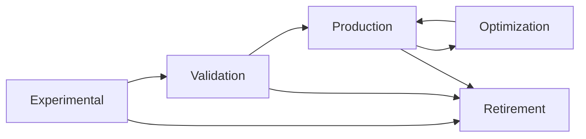

# Advanced Agent Factory System

An intelligent, self-improving agent factory that dynamically generates, manages, and evolves specialized agents for the Exocortex plugin following SOLID principles, GRASP patterns, and software engineering best practices.

## 🎯 Overview

The Agent Factory System is a comprehensive solution for managing the lifecycle of AI agents, from creation to retirement. It provides automated agent generation, performance monitoring, evolutionary optimization, and intelligent orchestration.

### Key Features

- **🤖 Dynamic Agent Generation**: Creates agents based on SOLID principles and GRASP patterns
- **📊 Performance Monitoring**: Real-time metrics collection and analysis
- **🧬 Evolutionary Optimization**: Self-improving agents through pattern learning
- **🎵 Intelligent Orchestration**: Parallel and pipeline execution patterns
- **⚡ Lifecycle Management**: Automated state transitions from experimental to production
- **📈 Quality Assurance**: Comprehensive validation and quality gates

## 🏗️ Architecture

### Core Components

```typescript
AgentFactory
├── AgentNecessityAnalyzer     // SOLID/GRASP analysis for agent creation decisions
├── AgentTemplateSystem        // Template-based agent generation
├── AgentPerformanceMonitor    // Metrics collection and analysis
├── AgentEvolutionEngine       // Learning and optimization
├── AgentOrchestrator         // Multi-agent coordination
└── AgentLifecycleManager     // State management and transitions
```

### Design Patterns

- **Factory Pattern**: Central agent creation and management
- **Template Method**: Standardized agent generation process
- **Observer Pattern**: Performance monitoring and alerting
- **Strategy Pattern**: Multiple orchestration patterns
- **State Pattern**: Agent lifecycle management

## 🚀 Quick Start

### Basic Usage

```typescript
import { AgentFactory } from "@/infrastructure/agents";

// Initialize the factory
const factory = new AgentFactory({
  monitoringEnabled: true,
  evolutionEnabled: true,
  orchestrationEnabled: true,
  lifecycleEnabled: true,
  qualityThreshold: 0.8,
});

// Create an agent
const request = {
  requirements: {
    domain: "testing",
    complexity: 7,
    urgency: "medium",
    capabilities: ["unit-testing", "integration-testing"],
    constraints: ["performance"],
    expectedLoad: 100,
  },
  urgency: "medium",
  requesterId: "user-123",
  context: { source: "manual-request" },
};

const result = await factory.createAgent(request);
if (result.isSuccess) {
  const { decision, agent, deploymentPlan } = result.getValue();
  console.log(`Decision: ${decision.decision}`);
  console.log(`Agent: ${agent?.name}`);
}
```

### Performance Monitoring

```typescript
// Record agent performance
const performance = {
  averageResponseTime: 25,
  successRate: 0.95,
  errorRate: 0.02,
  memoryUsage: 512,
  cpuUsage: 35,
  // ... other metrics
};

const quality = {
  functionality: { completeness: 0.9, correctness: 0.95 },
  reliability: { maturity: 0.85, availability: 0.99 },
  // ... other quality metrics
};

await factory.recordPerformance(agentId, performance, quality, context);
```

### Agent Evolution

```typescript
// Evolve an underperforming agent
const evolutionResult = await factory.evolveAgent(agentId);
if (evolutionResult.isSuccess) {
  const proposal = evolutionResult.getValue();
  console.log(`Evolution confidence: ${proposal.confidence}`);
  console.log(
    `Expected improvement: ${proposal.expectedImpact.performanceGain}`,
  );
}
```

### Multi-Agent Orchestration

```typescript
// Orchestrate complex task across multiple agents
const complexTask = {
  domain: "full-stack-development",
  complexity: 9,
  capabilities: ["frontend", "backend", "testing", "deployment"],
  expectedLoad: 500,
};

const plan = await factory.orchestrateExecution(complexTask);
if (plan.isSuccess) {
  const execution = plan.getValue();
  console.log(`Pattern: ${execution.pattern.name}`);
  console.log(`Agents: ${execution.agents.length}`);
}
```

## 📊 Agent States and Lifecycle

### State Transitions



### State Characteristics

| State            | Duration   | Monitoring       | Scope    | Success Criteria               |
| ---------------- | ---------- | ---------------- | -------- | ------------------------------ |
| **Experimental** | 7 days     | Intensive (5min) | Limited  | Error rate < 5%, Success > 80% |
| **Validation**   | 14 days    | Regular (10min)  | Expanded | Error rate < 2%, Success > 90% |
| **Production**   | Indefinite | Standard (30min) | Full     | Continuous optimization        |
| **Optimization** | Variable   | Analysis-driven  | Full     | Performance improvements       |

## 🎯 Decision Framework

### SOLID Principles Analysis

The system evaluates agent creation needs using SOLID principles:

- **Single Responsibility**: Threshold 0.85 - Create if overlap > 15%
- **Open/Closed**: Threshold 0.90 - Create if extension risk > 10%
- **Liskov Substitution**: Threshold 0.95 - Create if substitution impossible
- **Interface Segregation**: Threshold 0.80 - Create if interface mismatch > 20%
- **Dependency Inversion**: Threshold 0.75 - Create if coupling increase > 25%

### GRASP Patterns Assessment

```typescript
interface GRASPMetrics {
  informationExpert: number; // 0-1: Domain knowledge fit
  creator: number; // 0-1: Creation responsibility fit
  controller: number; // 0-1: Coordination capability
  lowCoupling: number; // 0-1: Independence level
  highCohesion: number; // 0-1: Internal relatedness
  polymorphism: number; // 0-1: Behavioral variation support
  pureDesign: number; // 0-1: Side-effect freedom
  indirection: number; // 0-1: Abstraction appropriateness
  protectedVariations: number; // 0-1: Change isolation
}
```

## 🔄 Evolution Patterns

### Built-in Evolution Patterns

1. **Response Time Optimization**
   - Trigger: Average response time > 30s
   - Action: Implement caching and indexing
   - Expected improvement: 20-40%

2. **Error Handling Enhancement**
   - Trigger: Error rate > 5%
   - Action: Add circuit breaker patterns
   - Expected improvement: 30-50% error reduction

3. **Resource Optimization**
   - Trigger: Memory/CPU usage > thresholds
   - Action: Implement pooling and optimization
   - Expected improvement: 25% resource efficiency

### Custom Evolution Patterns

```typescript
const customPattern: EvolutionPattern = {
  id: "custom-optimization",
  name: "Custom Optimization Pattern",
  trigger: {
    type: "performance",
    condition: "customMetric > threshold",
    threshold: 100,
    timeWindow: 3600000,
  },
  transformation: {
    type: "optimize",
    target: [{ component: "workflows" }],
    changes: [
      {
        action: "add",
        content: "Custom optimization logic",
        rationale: "Improve specific metric",
        impact: "medium",
      },
    ],
  },
  successMetrics: [
    {
      metric: "customMetric",
      expectedChange: "decrease",
      minimumImprovement: 0.2,
      timeframe: 3600000,
    },
  ],
};
```

## 🎵 Orchestration Patterns

### Available Patterns

1. **Parallel Processing**
   - Use case: Independent tasks
   - Speedup: 2.5x average
   - Success rate: 90%

2. **Sequential Pipeline**
   - Use case: Dependent tasks
   - Quality improvement: 15%
   - Resource efficiency: 85%

3. **Scatter-Gather**
   - Use case: Aggregation tasks
   - Throughput: 3x increase
   - Fault tolerance: High

4. **Competition**
   - Use case: Quality optimization
   - Quality improvement: 25%
   - Resource cost: Higher

### Custom Orchestration

```typescript
const customPattern: OrchestrationPattern = {
  id: "custom-pattern",
  name: "Custom Orchestration",
  type: "hybrid",
  applicability: [
    { condition: "high_complexity", weight: 0.8, required: true },
  ],
  coordination: {
    communicationPattern: "publish-subscribe",
    synchronization: "hybrid",
    errorHandling: "graceful-degradation",
    resourceSharing: "queued",
  },
};
```

## 📈 Performance Metrics

### System-Level Metrics

- **Creation Success Rate**: >95% target
- **Average Creation Time**: <5 minutes
- **Agent Reuse Rate**: >70% target
- **Evolution Success Rate**: >85% target
- **System Throughput**: Agents × 100 tasks/hour

### Agent-Level Metrics

- **Response Time**: P95 < 30s, P99 < 60s
- **Success Rate**: >95% target
- **Error Rate**: <2% target
- **Resource Efficiency**: <75% CPU, <1GB RAM
- **Quality Score**: >0.8 target

### Quality Dimensions

Based on ISO/IEC 25010:

- **Functionality**: Completeness, Correctness, Appropriateness
- **Reliability**: Maturity, Availability, Fault Tolerance, Recoverability
- **Usability**: Understandability, Learnability, Operability
- **Efficiency**: Time Behavior, Resource Utilization
- **Maintainability**: Analyzability, Changeability, Stability, Testability

## 🛠️ Configuration

### Factory Configuration

```typescript
const config: AgentFactoryConfig = {
  templatePath: "/custom/templates",
  monitoringEnabled: true,
  evolutionEnabled: true,
  orchestrationEnabled: true,
  lifecycleEnabled: true,
  maxAgentsPerDomain: 10,
  qualityThreshold: 0.8,
};
```

### Performance Thresholds

```typescript
const thresholds: PerformanceThresholds = {
  responseTime: { target: 30, warning: 60, critical: 120 },
  errorRate: { target: 0.02, warning: 0.05, critical: 0.1 },
  successRate: { target: 0.95, warning: 0.9, critical: 0.8 },
  resourceUsage: {
    memory: { target: 512, warning: 1024, critical: 2048 },
    cpu: { target: 50, warning: 75, critical: 90 },
  },
};
```

## 🧪 Testing

### Running Tests

```bash
# Run all agent factory tests
npm test -- src/infrastructure/agents

# Run specific component tests
npm test -- AgentFactory.test.ts
npm test -- AgentNecessityAnalyzer.test.ts
npm test -- AgentTemplateSystem.test.ts

# Run with coverage
npm test -- --coverage src/infrastructure/agents
```

### Test Categories

- **Unit Tests**: Individual component testing
- **Integration Tests**: Cross-component interactions
- **Performance Tests**: Load and stress testing
- **Quality Tests**: Validation and compliance
- **End-to-End Tests**: Complete workflow testing

## 📋 Best Practices

### Agent Creation

1. **Always analyze necessity first** - Use SOLID/GRASP analysis
2. **Prefer reuse over creation** - Check existing agents
3. **Follow template patterns** - Ensure consistency
4. **Validate thoroughly** - Use quality gates
5. **Monitor from start** - Track performance immediately

### Performance Optimization

1. **Monitor continuously** - Use real-time metrics
2. **Evolve systematically** - Apply proven patterns
3. **Orchestrate intelligently** - Choose optimal patterns
4. **Maintain quality** - Don't sacrifice quality for speed
5. **Learn from history** - Use accumulated knowledge

### System Management

1. **Maintain clean architecture** - Follow SOLID principles
2. **Monitor system health** - Track overall metrics
3. **Optimize regularly** - Run system optimization
4. **Plan for scale** - Consider growth patterns
5. **Document decisions** - Maintain decision history

## 🔗 Integration

### With Existing Systems

```typescript
// Integration with Obsidian Plugin
import { AgentFactory } from "@/infrastructure/agents";
import { DIContainer } from "@/infrastructure/container/DIContainer";

// Register with DI container
container.register("AgentFactory", AgentFactory);

// Use in plugin services
class ExocortexPlugin {
  private agentFactory: AgentFactory;

  async onload() {
    this.agentFactory = container.resolve("AgentFactory");
    await this.initializeAgentSystem();
  }
}
```

### Event Integration

```typescript
// Listen to agent events
factory.on("agentCreated", (agent) => {
  console.log(`New agent created: ${agent.name}`);
});

factory.on("agentEvolved", (evolution) => {
  console.log(`Agent evolved: ${evolution.agentId}`);
});

factory.on("performanceAlert", (alert) => {
  console.log(`Performance alert: ${alert.message}`);
});
```

## 🚨 Troubleshooting

### Common Issues

1. **High Creation Time**
   - Check template complexity
   - Verify system resources
   - Review validation requirements

2. **Low Success Rates**
   - Analyze failure patterns
   - Review quality thresholds
   - Check agent specifications

3. **Performance Degradation**
   - Monitor resource usage
   - Check for evolution opportunities
   - Review orchestration patterns

4. **Evolution Failures**
   - Verify performance data
   - Check evolution patterns
   - Review confidence thresholds

### Debug Mode

```typescript
const factory = new AgentFactory({
  ...config,
  debugMode: true,
  logLevel: "verbose",
});
```

## 📚 API Reference

See the exported types and interfaces in `src/infrastructure/agents/index.ts` for complete API documentation.

## 🤝 Contributing

1. Follow existing patterns and architecture
2. Add comprehensive tests for new features
3. Update documentation for changes
4. Ensure quality gates pass
5. Consider performance impact

## 📄 License

This is part of the Exocortex Obsidian Plugin and follows the same license terms.
